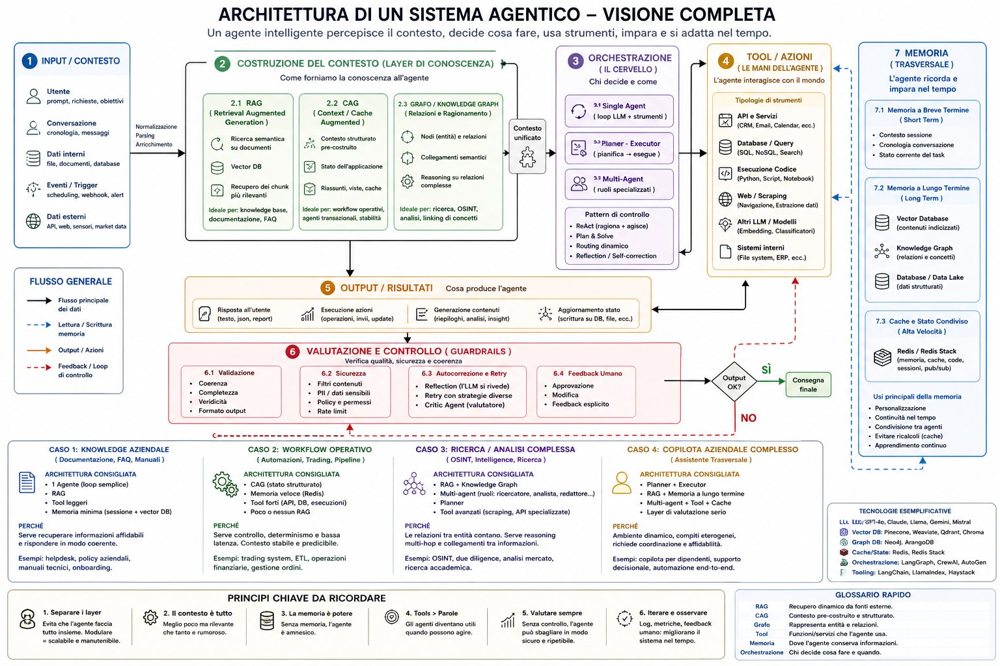

# Cos'è un Agent Harness

> **Key message:** Il modello è il motore, l'harness è l'automobile. Cambiare solo l'infrastruttura attorno allo stesso modello — senza toccare pesi né architettura — può spostare un agente di 20+ posizioni nei benchmark di programmazione.



## Definizione

Un harness è l'**infrastruttura software fissa che trasforma un modello in un agente**.

Un LLM da solo è un generatore di testo one-shot: riceve un prompt, produce output, si ferma. L'harness è ciò che gli dà la capacità di prendere azioni, osservare le conseguenze, e continuare finché il problema è effettivamente risolto.

La formula canonica, coniata da Vivek Trivedy di LangChain:

> **"If you're not the model, you're the harness."**

In pratica: Claude Code, Codex, Cursor, Windsurf sono harness. Non modelli, non framework — harness. Ognuno ha una struttura interna analoga: un while loop con un registro di tool e un layer di permessi, tutto precablato.


## Harness ≠ Framework

La distinzione vale la pena chiarire perché i termini vengono usati in modo intercambiabile, creando confusione.

|               | **Framework** (LangChain, LangGraph, AutoGen, CrewAI) | **Harness** (Claude Code, Codex, Cursor)      |
| ------------- | ----------------------------------------------------- | --------------------------------------------- |
| Premessa      | L'architetto umano assembla i pezzi                   | Nessun passaggio di assembly                  |
| Cosa fornisce | Astrazioni (chain, state, retriever)                  | Agente funzionante out of the box             |
| Chi configura | Tu                                                    | L'harness stesso                              |
| Struttura     | Pezzi da cablare                                      | While loop + tool registry + permission layer |

Un framework è costruito perché un umano assembli un agente. Un harness è costruito perché l'agente esegua un task. Tu fornisci il goal, l'harness gestisce il resto.

## La Metafora del Computer Von Neumann

Beren Millidge (2023) ha reso questa analogia precisa nel saggio _Scaffolded LLMs as Natural Language Computers_:

| Sistema Classico       | Sistema Agentico |
| ---------------------- | ---------------- |
| CPU                    | LLM              |
| RAM (veloce, limitata) | Context window   |
| Disco (lento, grande)  | Database esterni |
| Device driver          | Tool integration |
| Sistema operativo      | **Harness**      |

Come scrive Millidge: **"Abbiamo reinventato l'architettura Von Neumann"** — perché è un'astrazione naturale per qualsiasi sistema computazionale.

## Tre Livelli di Engineering

```
Harness Engineering
└── Context Engineering
    └── Prompt Engineering
```

- **Prompt engineering**: cosa dice il modello
- **Context engineering**: cosa vede il modello e quando
- **Harness engineering**: entrambi, più l'intera infrastruttura — orchestrazione tool, persistenza stato, error recovery, loop di verifica, enforcement sicurezza, lifecycle management

L'harness non è un wrapper attorno a un prompt. È il sistema completo che rende possibile il comportamento agente autonomo.

## I 9 Componenti Fondamentali


### 1. Il While Loop (Orchestration Engine)

Il cuore pulsante. Implementa il ciclo TAO (Thought-Action-Observation), anche chiamato ReAct loop:

```
assembla prompt → chiama LLM → analizza output → esegui tool call → feed risultati → ripeti
```

Il loop è meccanicamente semplice — spesso letteralmente un `while`. La complessità sta in tutto ciò che gestisce, non nel loop stesso. Anthropic descrive il proprio runtime come un "dumb loop": tutta l'intelligenza vive nel modello, l'harness gestisce solo i turni.

Il loop termina quando:

- Il modello produce una risposta senza tool call
- Si raggiunge il cap massimo di iterazioni
- Il budget di token si esaurisce
- Una guardrail tripwire scatta
- L'utente interrompe

### 2. Context Management

Il fallimento silenzioso di molti agenti. Il problema core è il **context rot**: le performance del modello degradano del 30%+ quando i contenuti chiave cadono in posizioni centrali della finestra (Stanford "Lost in the Middle"). Anche finestre da un milione di token soffrono di degradazione dell'instruction-following man mano che il contesto cresce.

Strategie di produzione:

- **Compaction**: Claude Code mantiene i messaggi più recenti verbatim, riassume tutto il resto quando si avvicina all'80-90% del budget
- **Observation masking**: JetBrains' Junie nasconde i vecchi tool output mantenendo visibili le tool call
- **Just-in-time retrieval**: identificatori leggeri caricati dinamicamente (grep, glob, head/tail invece di caricare file interi)
- **Delegazione a sub-agent**: ogni subagente esplora estensivamente ma ritorna solo 1.000–2.000 token di sintesi

Goal: **il minimo set possibile di token ad alto segnale** che massimizza la probabilità dell'output desiderato.

### 3. Tools e Skills

I tool sono le **mani** dell'agente. Sono definiti come schemi (nome, descrizione, tipi di parametri) iniettati nel contesto LLM. Il layer tool gestisce: registrazione, validazione schema, estrazione argomenti, esecuzione sandboxed, cattura risultati, formattazione osservazioni.

```
Tool = primitiva universale (read_file, run_bash, search)
Skill = tool il cui handler legge un file Markdown all'invocazione
Registry = dizionario {nome → {permesso, handler, descrizione}}
```

Tool = universali. Skill = specifici al tuo team, al tuo workflow. Il registry dice cosa è disponibile, quale permesso richiede ogni cosa, come viene dispatchata la chiamata.

Un principio importante: **meno tool = performance migliori**. Vercel ha rimosso l'80% dei tool da v0 e ottenuto risultati migliori. Claude Code ottiene una riduzione del 95% del contesto tramite lazy loading.

### 4. Memoria

La memoria opera su più timescale:

- **Short-term**: cronologia conversazione nella sessione corrente
- **Long-term**: persiste tra sessioni — Claude Code usa `CLAUDE.md` e `MEMORY.md`; append-only JSON event log per durabilità

Il principio critico di design: **l'agente tratta la propria memoria come un "suggerimento" e verifica sullo stato reale prima di agire**. Una memoria che nomina un file o una funzione è una claim su come era il codice quando è stata scritta — va verificata prima di essere usata.

### 5. System Prompt Assembly

Il system prompt non è una stringa statica. È una pipeline che:

1. Carica la parte statica (sempre in testa, per prefix caching)
2. Cammina le directory antenate cercando `CLAUDE.md`/`AGENTS.md`
3. Inietta memory files on demand
4. Appende la conversazione e il messaggio utente corrente

**L'ordine conta**: la parte statica prima, il contenuto dinamico dopo. Invertire l'ordine rompe il prefix caching e fa lievitare i costi.

### 6. Output Parsing e State Management

Gli harness moderni usano native tool calling: il modello ritorna oggetti `tool_calls` strutturati invece di testo libero da parsare. La logica è:

```
tool_calls presenti? → esegui e loop
tool_calls assenti? → risposta finale
```

Per lo state management, LangGraph modella lo stato come dizionari tipizzati con checkpoint a ogni super-step. Claude Code usa un approccio diverso: **git commit come checkpoint** e progress file come scratchpad strutturati.

### 7. Error Handling

Perché conta: un processo a 10 step con 99% di successo per step ha solo ~90.4% di successo end-to-end. Gli errori si compongono velocemente.

Quattro tipologie di errore:

| Tipo            | Gestione                                                      |
| --------------- | ------------------------------------------------------------- |
| Transiente      | Retry con backoff                                             |
| LLM-recoverable | Ritorna errore come ToolMessage (il modello si auto-corregge) |
| User-fixable    | Interrompi per input umano                                    |
| Inaspettato     | Bolla in superficie per debugging                             |

Anthropic cattura i fallimenti dentro i tool handler e li ritorna come risultati di errore per mantenere il loop in esecuzione. Stripe in produzione limita i retry a due tentativi.

### 8. Lifecycle Hooks (Estensibilità)

I hook iniettano logica custom prima o dopo l'esecuzione di un tool senza toccare l'harness stesso:

```
PreToolHook  → riceve nome tool + input → può allow/deny/modify
PostToolHook → riceve output → audit/logging/osservabilità (non può bloccare)
```

I hook sono come le imprese oggi adottano gli harness: non modificano il core, ma iniettano controllo ai punti giusti. In Claude Code, `bash.py` come PreToolUse hook implementa blocchi di sicurezza con `exit 2` — non suggerimenti, blocchi effettivi che non possono essere aggirati.

### 9. Permessi e Safety

Il layer che fa la differenza tra uno strumento utile e uno pericoloso.

Gli harness moderni definiscono una gerarchia di permission mode:

```
read-only < workspace-write < full-access
```

Ogni tool dichiara il permesso minimo richiesto. Il job dell'harness è enforzarlo al momento del dispatch, prima che il tool venga mai eseguito.

Per tool come bash, l'harness classifica i comandi **dinamicamente**:

- `ls`, `cat`, `grep` → read-only
- `rm`, `sudo`, `shutdown` → full-access
- tutto il resto → workspace

Su questi controlli statici si aggiungono le **interactive approval**: l'agente si ferma, chiede "devo eseguire questo?", attende conferma prima di qualsiasi operazione distruttiva.

## Il Loop in Azione: Step-by-Step


1. **Prompt Assembly** — system prompt + tool schema + memory files + conversazione + messaggio utente. Contenuto importante posizionato all'inizio e alla fine (finding "Lost in the Middle").
2. **LLM Inference** — il prompt assemblato va all'API. Il modello genera: testo, tool call request, o entrambi.
3. **Output Classification** — testo senza tool call → loop termina. Tool call richieste → esecuzione. Handoff richiesto → aggiorna agente corrente e ricomincia.
4. **Tool Execution** — per ogni tool call: valida argomenti, verifica permessi, esegui in sandbox, cattura risultati. Operazioni read-only in concorrenza; operazioni mutanti in serie.
5. **Result Packaging** — risultati formattati come messaggi LLM-readable. Errori catturati e ritornati come error result per auto-correzione del modello.
6. **Context Update** — risultati aggiunti alla cronologia. Se si avvicina al limit, scatta la compaction.
7. **Loop** — torna a Step 1.

Una domanda semplice: 1–2 turni. Un refactoring complesso: decine di tool call su molti turni.

## Verification Loops — Il Differenziatore

Questo è ciò che separa i demo toy dagli agenti in produzione.

Tre approcci complementari:

1. **Rules-based feedback** — test, linter, type checker. Verifica computazionale deterministica.
2. **Visual feedback** — screenshot via Playwright per task UI. Verifica che il rendering sia quello atteso.
3. **LLM-as-judge** — un sub-agente separato valuta l'output. Cattura problemi semantici che i tool deterministi non vedono.

Boris Cherny (creatore di Claude Code): **dare al modello un modo per verificare il proprio lavoro migliora la qualità di 2–3x**.

## Come i Framework lo Implementano


**Claude Agent SDK** — espone l'harness tramite una singola funzione `query()` che crea il loop agentico e ritorna un async iterator. Il runtime è "dumb loop". Tutto l'intelligenza nel modello. Claude Code usa un ciclo Gather-Act-Verify: raccogli contesto → azione → verifica risultati → ripeti.

**OpenAI Agents SDK** — implementa l'harness tramite la classe `Runner` con tre modalità (async, sync, streamed). Code-first: logica workflow in Python nativo invece di DSL a grafo.

**LangGraph** — modella l'harness come grafo di stato esplicito. Due nodi (`llm_call` e `tool_node`) connessi da un conditional edge: se tool call presenti → `tool_node`; se assenti → `END`.

**CrewAI** — architettura multi-agente role-based: Agent (harness attorno all'LLM), Task (unità di lavoro), Crew (collezione di agenti). Il layer Flows aggiunge una "backbone deterministica con intelligenza dove conta".

**AutoGen** — tre livelli (Core, AgentChat, Extensions), cinque pattern di orchestrazione: sequenziale, concorrente, group chat, handoff, magentic (un manager agent mantiene un task ledger dinamico).

## La Metafora dell'Impalcatura


L'impalcatura edilizia non fa la costruzione. Ma senza di essa, i lavoratori non raggiungono i piani alti.

**L'insight chiave: l'impalcatura viene rimossa quando l'edificio è completo.** Man mano che i modelli migliorano, la complessità dell'harness dovrebbe diminuire. Manus è stato riscritto 5 volte in 6 mesi, ogni riscrittura rimuovendo complessità. Definizioni tool complesse diventate shell execution generale. "Management agent" diventati semplici structured handoff.

Questo punta al **principio di co-evoluzione**: i modelli vengono ora post-trained con harness specifici nel loop. Il modello di Claude Code ha imparato a usare l'harness specifico con cui è stato trainato. Cambiare le implementazioni dei tool può degradare le performance per questo accoppiamento stretto.


**Test di future-proofing** per la progettazione di harness: se le performance scalano con modelli più potenti senza aggiungere complessità all'harness, il design è solido.

## 7 Decisioni che Definiscono Ogni Harness


1. **Single-agent vs multi-agent** — Anthropic e OpenAI dicono entrambi: massimizza prima un singolo agente. I sistemi multi-agente aggiungono overhead (chiamate LLM extra per routing, perdita di contesto durante gli handoff). Splitta solo quando il tool overload supera ~10 tool sovrapposti o esistono chiaramente domini di task separati.

2. **ReAct vs plan-and-execute** — ReAct intervalla reasoning e azione a ogni step (flessibile ma costo per-step più alto). Plan-and-execute separa pianificazione da esecuzione. LLMCompiler riporta un **speedup di 3.6x** rispetto a ReAct sequenziale.

3. **Strategia di context window management** — cinque approcci in produzione: clearing time-based, summarization conversazione, observation masking, structured note-taking, sub-agent delegation. La ricerca ACON mostra **riduzione 26–54% dei token preservando 95%+ di accuratezza** prioritizzando reasoning trace rispetto ai raw tool output.

4. **Design del verification loop** — la verifica computazionale (test, linter) dà ground truth deterministica. La verifica inferenziale (LLM-as-judge) cattura problemi semantici ma aggiunge latenza. Il framework di Thoughtworks: **guide** (feedforward, steer prima dell'azione) vs **sensor** (feedback, osserva dopo l'azione).

5. **Architettura permessi e safety** — permissiva (veloce ma rischiosa, auto-approva la maggior parte delle azioni) vs restrittiva (sicura ma lenta, richiede approvazione per ogni azione). La scelta dipende dal contesto di deployment.

6. **Tool scoping strategy** — più tool spesso significa performance peggiori. L'obiettivo è esporre il set minimo di tool necessari per lo step corrente.

7. **Harness thickness** — quanta logica vive nell'harness vs nel modello. Anthropic scommette su harness sottili e miglioramento del modello. I framework a grafo scommettono sul controllo esplicito. Anthropic rimuove regolarmente step di pianificazione dall'harness di Claude Code man mano che le nuove versioni del modello internalizzano quella capacità.

## Mini Harness in Python — Struttura di Riferimento

```python
# Struttura minima — tutti i 9 componenti visibili

class ToolRecord:
    name: str
    permission: Literal["read", "workspace", "full"]
    handler: Callable
    description: str

class HarnessEngine:
    registry: dict[str, ToolRecord]
    history: list[dict]
    session_log: AppendOnlyLog  # JSON append-only per durabilità
    max_iterations: int = 50

    def run(self, goal: str) -> str:
        system = self._assemble_system_prompt()  # statico prima, dinamico dopo
        self.history.append({"role": "user", "content": goal})

        for _ in range(self.max_iterations):
            # compaction se il contesto supera soglia
            if self._token_count() > self.COMPACTION_THRESHOLD:
                self._compact()

            response = llm_call(system, self.history, self.registry.descriptors())

            if not response.tool_calls:
                return response.text  # terminazione naturale

            for call in response.tool_calls:
                record = self.registry.get(call.name)
                # pre-tool hook: can allow/deny/modify
                if not self._pre_hook(record, call.args):
                    continue
                # permission check prima dell'esecuzione
                self._enforce_permission(record)
                result = record.handler(**call.args)
                # post-tool hook: audit/logging
                self._post_hook(record, result)
                self.session_log.append({"tool": call.name, "result": result})
                self.history.append({"role": "tool", "content": result})

        raise MaxIterationsExceeded()
```

Il loop è l'intero motore. Ogni altro file nel progetto esiste per supportare queste poche righe.

## L'Harness è il Prodotto

Due prodotti che usano modelli identici possono avere performance radicalmente diverse basandosi esclusivamente sul design dell'harness. L'evidenza di TerminalBench è chiara: cambiare solo l'harness ha mosso agenti di 20+ posizioni nel ranking.

L'harness non è un problema risolto né un layer commodity. È dove vive l'engineering difficile: gestire il contesto come risorsa scarsa, progettare loop di verifica che catturano i fallimenti prima che si compongano, costruire sistemi di memoria che forniscono continuità senza allucinazione, e fare scommesse architetturali su quanta scaffolding costruire versus quanto lasciare al modello.

Il campo si muove verso harness più sottili man mano che i modelli migliorano. Ma l'harness stesso non sparirà. Anche il modello più capace ha bisogno di qualcosa che gestisca la sua context window, esegua le sue tool call, persista il suo stato, e verifichi il suo lavoro.

La prossima volta che il tuo agente fallisce, non incolpare il modello. Guarda l'harness.

## Fonti

> **[fonte principale]** [@akshay_pachaar — "The Anatomy of an Agent Harness"](https://x.com/akshay_pachaar/status/2041146899319971922) — deep dive completo su 12 componenti, implementazioni reali (Anthropic, OpenAI, LangChain, CrewAI, AutoGen), pattern architetturali e 7 decisioni fondamentali.

> **[fonte video]** [What is an Agent Harness? and How to build a great one!](https://www.youtube.com/watch?v=nWzXyjXCoCE) — @akshay_pachaar: definizione harness vs framework, 9 componenti con walkthrough Python, prefix caching e dynamic permission classification.

> **[riferimento accademico]** [Scaffolded LLMs as Natural Language Computers](https://www.beren.io/2023-04-11-Scaffolded-LLMs-natural-language-computers/) — Beren Millidge: la metafora Von Neumann applicata agli LLM.
