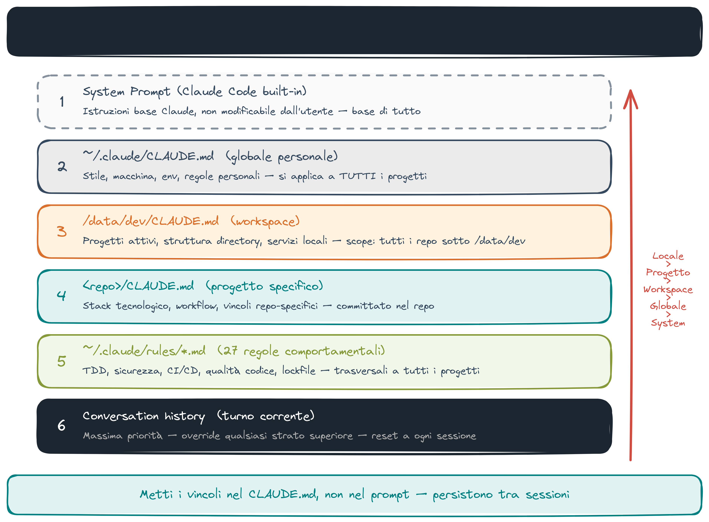
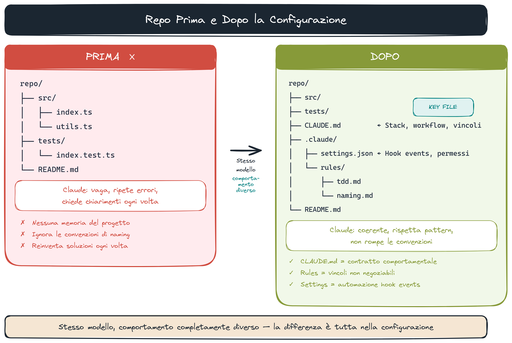
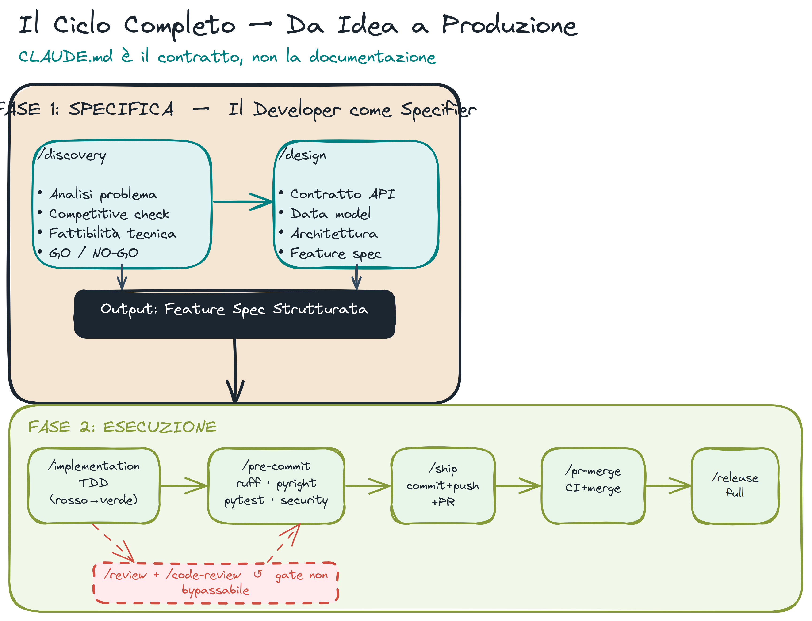
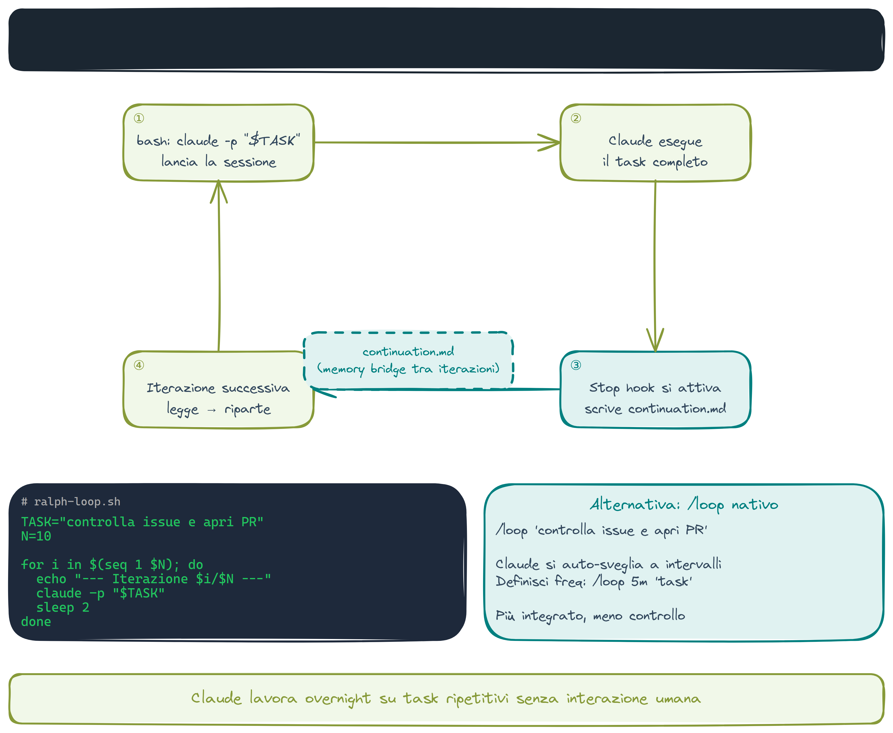

# Harnessing — Come Strutturare Repos per AI Tools

> **Key message:** CLAUDE.md non è documentazione — è il contratto che definisce come il sistema si comporta dall'inizio alla fine del ciclo. Il workflow codificato nel CLAUDE.md è il prodotto.

## CLAUDE.md come Contratto

Il file `CLAUDE.md` non è documentazione. È un contratto comportamentale.

```markdown
# Project Name

## Stack

- Python 3.12, uv, FastAPI
- PostgreSQL (asyncpg), Redis

## Workflow

- TDD: test prima dell'implementazione
- Commit: conventional commits (feat/fix/docs/chore)
- Branch: feature/<issue>-slug

## Non fare

- Non aggiungere dipendenze senza giustificazione
- Non committare senza /security-verify scan
```

**Livelli di CLAUDE.md:**

1. `~/.claude/CLAUDE.md` — globale (stile, macchina, env)
2. `~/dev/CLAUDE.md` — workspace (progetti attivi, struttura)
3. `<repo>/CLAUDE.md` — progetto (stack, workflow, regole specifiche)

> **[fonte]** [AI-assisted Coding for Teams That Can't Get Away With Vibes](https://blog.nilenso.com/blog/2025/05/29/ai-assisted-coding/) — approfondisce CLAUDE.md come contratto comportamentale: metaprompting per far emergere tradeoff prima del codice, RULES.md e ADR come prerequisiti che replicano a livello team lo stesso principio.

## Context Engineering



Il modello legge il contesto da più fonti nell'ordine:

1. System prompt (istruzioni Claude Code)
2. CLAUDE.md files (dal globale al locale)
3. Rules files (`~/.claude/rules/`)
4. Conversation history

**Principi:**

- Metti vincoli nel CLAUDE.md, non nel prompt
- Rules per comportamenti trasversali (sicurezza, qualità, git)
- Memory per stato cross-sessione

> **[fonte]** [Effective Context Engineering for AI Agents](https://www.anthropic.com/engineering/effective-context-engineering-for-ai-agents) — approfondisce il layer model di Context Engineering: context rot, progressive disclosure, compaction e il ruolo di NOTES.md come bridge tra sessioni (sezione omonima del doc).

## Before/After — Repo mal-configurato vs ben-configurato



### ❌ Prima

```
repo/
├── src/
├── tests/
└── README.md   # "This project does X"
```

Claude: vaga, ripete errori, chiede chiarimenti ogni volta.

### ✅ Dopo

```
repo/
├── src/
├── tests/
├── CLAUDE.md          # Stack, workflow, vincoli
├── .claude/
│   ├── settings.json  # Hook events
│   └── rules/
│       ├── tdd.md
│       └── naming.md
└── README.md
```

Claude: coerente, rispetta pattern esistenti, non rompe convenzioni.

## Spec-Driven Dev — Dal Requisito al Codice



Il developer come **specifier**, non writer. Prima si decide cosa fare, poi si delega l'esecuzione.

```
/discovery "aggiungi autenticazione OAuth"
  → analisi problema + competitive check + go/no-go

/design
  → API contract + data model + architettura

/spec --issue N
  → durable spec doc in docs/specs/ (letto automaticamente da /implementation)

/implementation --issue N
  → TDD: test rossi → implementazione → test verdi
```

`/spec` è il contratto scritto tra il planning e l'esecuzione. `/implementation` non esplora il codebase — legge la spec e la mappa (`docs/codebase/`) e parte. Non si scrive codice senza spec approvata.

> **[demo]** `/spec --issue N` — da idea a spec approvata in 5 min: `/discovery "aggiungi logging strutturato"` → `/design` → `/spec --issue N` → mostra il file `docs/specs/` prodotto. "Questo è il contratto. `/implementation` lo leggerà senza esplorare."

> **[demo]** `/implementation --issue N` — implementazione delegata: guarda TDD in azione con test rossi, implementazione minima, test verdi. Nessun codice scritto prima dei test.

> **[fonte]** [My LLM codegen workflow atm](https://harper.blog/2025/02/16/my-llm-codegen-workflow-atm/) — approfondisce Spec-Driven Dev: le tre fasi discrete (brainstorm spec → plan a plan → execute) che mappano direttamente su /discovery → /spec → /implementation.

## Il Ciclo Completo

```
/implementation    → TDD: test rossi → implementazione → test verdi
/pre-commit        → quality gates: lint, typecheck, test, security scan
/ship              → commit + push + PR creation
/pr-merge          → validazione CI + merge
/release full      → tag semantico + CHANGELOG aggiornato
/health full       → verifica endpoints, docs, security, dependencies
/docs full         → aggiorna documentazione cliente
```

**Esempio reale — sezione Workflow in `~/.claude/CLAUDE.md`:**

```markdown
## Workflow

- `/progress` — situational awareness: snapshot git+PR → prossimo step
- Presenta approccio prima di scrivere codice. Conferma esplicita.
- Default TDD: scrivi test che falliscono prima, poi implementa.
- Sicurezza prima del commit: `/security-verify scan`. Nessuna eccezione.
```

Questo snippet nel CLAUDE.md globale **forza** il comportamento su ogni repo, ogni sessione.

> **[demo]** `/ship` — ciclo completo in 2 min: `/ship` → PR aperta → `/release full` — mostra il CHANGELOG aggiornato e il tag semantico creato automaticamente.

## Reflection Loop — Quality Gates

Il loop dopo ogni implementazione:

```
/review gate       → check leggero: bug critici + security (Codex/Gemini)
                     → PASS: procedi | BLOCK: /fix e rilancia

/fix               → applica correzioni minimali, nessun PR
                     → rilancia /review gate

/review changes    → review completo prima del commit finale
                     (silent failures, tipi, commenti — companion AI)

/pre-commit        → pipeline completa: ruff + pyright + pytest + bandit
                     → gate non bypassabile (hook blocca --no-verify)
```

`/review gate` è il giudice. `/fix` è la risposta. Il loop continua finché gate non è verde. Se il loop non converge (root cause ignota): `/diagnose` — spawna un subagente con contesto fresco che parte senza il bias della sessione corrente.

`/pre-commit` è l'uscita obbligatoria. Non esiste `/ship` senza `/pre-commit` verde.

**Perché è non bypassabile:** il hook `bash.py` blocca `git commit --no-verify` con exit code 1. Il security gate è in `rules/security-gate.md`:

```markdown
# Security Gate

Always run `/security-verify scan` before suggesting `git commit` or `git push`.
Skip only if: config-only repo (no .py/.js/.ts files).
```

**Il prompt più potente in Claude Code:** `"Update CLAUDE.md so this doesn't happen again."` Ogni volta che Claude fa un errore, la risposta corretta non è correggerlo manualmente — è aggiungere una rule o una nota al CLAUDE.md perché non si ripeta. Nel tempo, il CLAUDE.md diventa un registro di tutti gli errori che non farai più. Questo è il meccanismo dietro `rules/` e il tipo di memoria `feedback`.

> **[demo]** reflection loop live — `/review gate` fallisce (mostra il BLOCK con motivazione). `/fix` applica la correzione. `/review gate` di nuovo — PASS. Solo ora: `/pre-commit` — ruff, pyright, pytest, bandit. Il gate è non bypassabile: mostra il hook che blocca `--no-verify`.
> **[demo]** pipeline FatturaPA — stesso pattern su caso reale, orchestratore LLM tra gli stage: [`docs/demos/demo-fatturapa-parser.md`](demos/demo-fatturapa-parser.md).

> **[fonte]** [Building agents with the Claude Agent SDK](https://claude.com/blog/building-agents-with-the-claude-agent-sdk) — approfondisce il Reflection Loop e il Ralph Loop: il ciclo gather→action→verify, la compaction per sessioni lunghe, e i tre modi di verifica (rules-based, visual feedback, LLM-as-judge).

## Ralph Wiggum Loop — Agent Autonomo



Per task ripetitivi o overnight, due pattern:

### `/loop` Nativo

```bash
/loop "controlla se ci sono nuovi issue nel milestone e apri una PR per ognuno"
```

Claude si auto-sveglia a intervalli, esegue il task, decide quando fermarsi.

### Ralph Wiggum Loop

Script bash + Stop hook per un loop autonomo senza interazione:

```bash
#!/bin/bash
# ralph-loop.sh — esegui un task ripetuto N volte
TASK="$1"
N="${2:-5}"

for i in $(seq 1 $N); do
  echo "=== Iterazione $i/$N ==="
  claude -p "$TASK"
  sleep 2
done
```

```bash
chmod +x ralph-loop.sh
./ralph-loop.sh "refactora un file dalla lista in TODO.md" 10
```

Il Stop hook scrive `continuation.md` dopo ogni iterazione — la sessione successiva riprende dal punto giusto.

> **[demo]** `/loop` e Ralph Loop — lancia `./ralph-loop.sh "ottimizza una funzione da TODO.md" 3`: mostra le tre iterazioni, poi apri `continuation.md` per vedere cosa ha scritto l'hook.

> **[fonte]** [Effective harnesses for long-running agents](https://www.anthropic.com/engineering/effective-harnesses-for-long-running-agents) — approfondisce il Ralph Loop autonomo overnight: pattern initializer + coding agent, claude-progress.txt per continuazione, git-based recovery, e i due failure mode da evitare (one-shot attempt, premature victory).

## Orchestration Patterns

Three patterns map to different task complexities:

### Single Agent (loop)

Used by `/quick`, `/fix` (simple), direct slash commands.
One LLM + tools, no planning phase. Fastest path.

```
PATH: INPUT → TOOL → OUTPUT → GUARDRAIL
```

### Planner-Executor (opusplan)

Used by `/implementation`.
Opus plans (15× cost), Sonnet implements (3× cost). Saves 60-80% vs all-Opus.

```
PATH: INPUT → [Explore × 1-3 Haiku] → [Plan Opus] → [Implement Sonnet] → OUTPUT → GUARDRAIL
```

Activate: `/model opus` → approve plan → `/model sonnet` → implement.
Skip for trivial tasks (single-file changes, obvious fixes).

### Multi-Agent Cross-Model

Used by `/review --all`, `/map-codebase`, `/diagnose`.
Parallel agents with different models/providers. Results combined via consensus.

```
PATH: INPUT → [Codex + Gemini + Claude parallel] → CONSENSUS → OUTPUT
```

The companion rule: "never fall back to Claude's own analysis." Cross-model review catches errors that self-review misses.

---

## Progressive Disclosure

Every skill has 3 levels:

- **Level 1** (~15 lines): loaded by default. Always in context.
- **Level 2** (patterns): loaded on request ("show patterns").
- **Level 3** (full reference): loaded on explicit demand only.

With 80+ skills, loading all at full depth saturates the context window. This is the mechanism that keeps large skill libraries usable. GSD, BMAD, and Superpowers don't solve this — they use flat configs that scale poorly beyond ~20 skills.

---

## Pattern Avanzati — Citazione

**Git worktrees** — isolamento per task rischiosi:

```bash
# Claude crea automaticamente worktree con EnterWorktree
# oppure manuale:
git worktree add .claude/worktrees/refactor-auth feature/refactor-auth
```

Il main rimane intoccato mentre si lavora nel worktree. Se il task fallisce, si fa `git worktree remove`.

**Headless mode** — CI/CD e automazione non interattiva:

```bash
# Claude Code headless
claude -p "run /pre-commit and fix any failures" --dangerously-skip-permissions

# Codex headless
codex exec "review all changed files for security issues"
```

**GitHub Action** con agente headless:

```yaml
# .github/workflows/ai-review.yml
- uses: anthropics/claude-code-action@v1
  with:
    prompt: "/code-review"
    dangerously_skip_permissions: true
```

