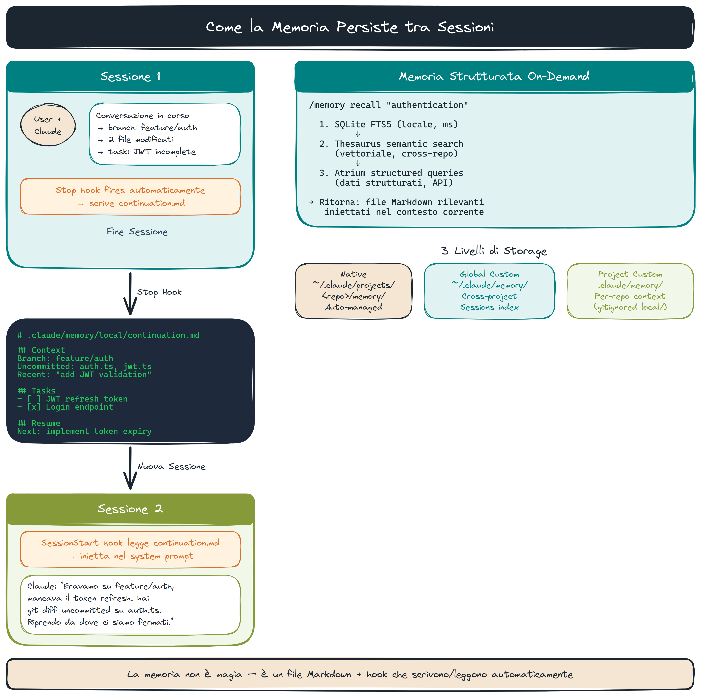
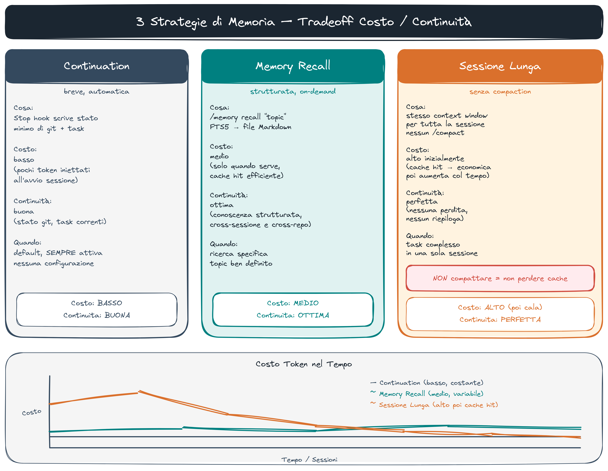

# Persistent Memory — Il Sistema Custom

> **Key message:** La sessione è effimera, il sistema deve essere persistente — il tuo job è costruire l'infrastruttura di memoria attorno all'agent.

## Tre Livelli di Storage

```
~/.claude/projects/<repo-hash>/memory/   # Native: per repo
~/.claude/memory/                         # Global: cross-project
<repo>/.claude/memory/                    # Project: per repo
<repo>/.claude/memory/local/             # Local: gitignored
```

## Come Funziona



### 1. Stop Hook → continuation.md

Alla fine di ogni risposta Claude, `hooks/handlers/memory.py` scrive automaticamente:

```markdown
# Continuation — 2026-05-12 10:30

## Branch

main

## Recent commits

abc123 feat: add support triage agent

## Uncommitted

1 file(s) modified
```

Alla sessione successiva, `session.py` inietta questo contesto nel system prompt.

> **[demo]** `continuation.md` — Termina una sessione Claude Code davanti agli studenti. Apri `.claude/memory/local/continuation.md` — mostra branch, commit recenti, file uncommitted scritti automaticamente dall'hook. Poi avvia una nuova sessione: mostra come `session.py` inietta quel contesto nel system prompt all'avvio. Infine: `/progress` — legge git state + continuation + issue aperti e restituisce il prossimo step concreto in una riga.

> **[fonte]** [Effective harnesses for long-running agents](https://www.anthropic.com/engineering/effective-harnesses-for-long-running-agents) — approfondisce il pattern Stop hook + continuation: come `claude-progress.txt` e `feature_list.json` implementano lo stesso meccanismo di ripresa sessione descritto in §1.

### 2. SQLite FTS5 — Memoria Strutturata

`hooks/handlers/memory_db.py` mantiene un database locale con full-text search. Tipi supportati: `user`, `feedback`, `project`, `reference`.

Ricerca via `/memory recall <query>` — restituisce snippet con score di rilevanza.

> Schema e codice `memory_db.py` disponibili su richiesta — non necessari per la demo.

### 3. JSON Files — Memoria Navigabile

Ogni memoria = file Markdown con frontmatter YAML:

```markdown
---
name: tdd-preference
description: Utente vuole test prima dell'implementazione
metadata:
  type: feedback
---

Non scrivere codice prima dei test. Motivazione: burn del Q4 con
mock che passavano ma prod migration falliva.
```

> **[fonte]** [Karpathy LLM Wiki (gist)](https://gist.github.com/karpathy/442a6bf555914893e9891c11519de94f) — alternativa senza vector DB ai JSON files di memoria: tre layer (raw immutabile, wiki LLM-owned, schema=CLAUDE.md) che risolvono lo stesso problema di persistenza strutturata.

## Read/Write nella Pratica

```bash
# Scrivi (Claude lo fa automaticamente, ma puoi forzare)
/memory extract   # estrae memorie dalla conversazione corrente

# Leggi
/memory recall "authentication"   # FTS5 + Thesaurus semantic search

# Stato
/memory status    # quante memorie, ultima sync
```

## Le Tre Strategie — Context Window e Tradeoff



La context window è finita. Ogni turno aggiunge token. Tre strategie per gestirlo:

### 1. Continuation (breve, automatica)

Il Stop hook scrive `continuation.md` alla fine di ogni sessione. La sessione successiva riprende con git state + file uncommitted + task pendenti — senza riaprire tutta la conversazione.

**Costo:** quasi zero. **Limite:** solo stato meccanico (branch, file), non decisioni architetturali.

### 2. Memory Recall (strutturata, on-demand)

`/memory recall "autenticazione"` — FTS5 + Thesaurus semantic search. Restituisce file di memoria rilevanti con snippet.

```bash
/memory recall "autenticazione"
# → finds: feedback_auth_jwt.md, project_oauth_decision.md
# → injects relevant sections into context
```

**Costo:** una query al momento del bisogno. **Vantaggio:** trova decisioni architetturali non ovvie dal codice.

> **[demo]** `/memory recall` live — `/memory recall "authentication"` — mostra il risultato (FTS5 + semantic search) con file trovati e score. Apri uno dei file trovati: mostra frontmatter YAML (`name`, `description`, `type: feedback`) + body con la decisione architetturale salvata.

### 3. Sessione Lunga Senza Compaction

Mantieni la sessione aperta per ore senza `/compact`. Il modello vede tutta la storia.

**Vantaggio:** coerenza massima, nessuna perdita di contesto.
**Costo:** ogni turno paga più token di input. Token cost cresce linearmente.

### Perché Non Compattare per Default

La compaction (riassumere la conversazione) azzera il prompt cache. Dopo la compaction, ogni turno ripaga la cache da zero — più lento e più costoso.

```
Senza compaction:  turno N → cache hit → +$0.08/1M token (cached)
Con compaction:    turno 1 dopo compact → cache miss → +$0.80/1M token (full)
```

Il cache hit rate è il parametro economico chiave. Il sistema di memoria è progettato per evitare la compaction, non per renderla sicura.

> **[demo]** strategie di memoria — Apri il contatore token di una sessione lunga. Spiega il grafico costo/turno: sale linearmente. Mostra perché la compaction costa di più via cache miss. Le tre strategie come risposta a questo problema.

> **[fonte]** [LLM Powered Autonomous Agents](https://lilianweng.github.io/posts/2023-06-23-agent/) — base teorica per le tre strategie di §3: la sezione Memory distingue short-term (context window), long-term (vector store), episodic — gli stessi tradeoff descritti in questo doc.

> **[fonte]** [Effective Context Engineering for AI Agents](https://www.anthropic.com/engineering/effective-context-engineering-for-ai-agents) — approfondisce il tradeoff context/costo: context rot (n² relazioni tra token), just-in-time retrieval come alternativa alla sessione lunga, e perché la compaction azzera il cache hit rate.

## Quando Aiuta, Quando No

**Aiuta:**

- Preferenze dell'utente che si ripetono
- Decisioni architetturali non ovvie dal codice
- Contesto di progetto (scadenze, motivazioni)
- Pattern di feedback ("non fare X perché Y")

**Non aiuta:**

- Struttura del codice (leggi i file)
- Storia git (usa `git log`)
- Stato CI (usa `fj ci tasks`)
- Informazioni già in CLAUDE.md

