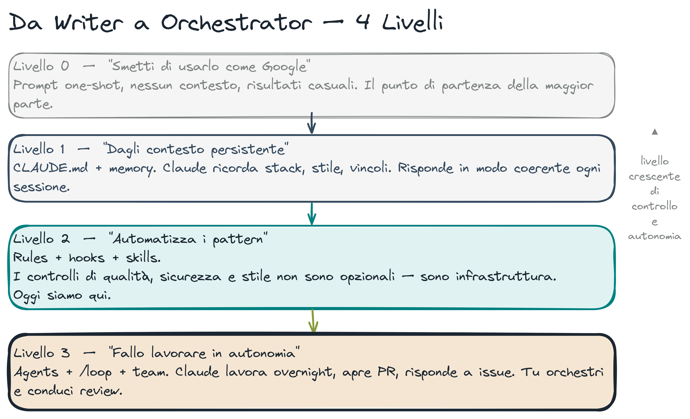

# Sandbox e Permission Modes

> **Key message:** Questi tool non sono chatbot — sono sistemi configurabili. Il permission model è il meccanismo che distingue "esplora e suggerisci" da "esegui in autonomia".

## I 3 livelli di configurazione e merge semantics

| File                          | Scope    | In git? | Uso                                |
| ----------------------------- | -------- | ------- | ---------------------------------- |
| `~/.claude/settings.json`     | globale  | no      | Regole valide su ogni progetto     |
| `.claude/settings.json`       | progetto | sì      | Regole condivise con il team       |
| `.claude/settings.local.json` | locale   | no      | Override personali, non committati |

Le regole si **fondono** a runtime. Se globale ha `allow: ["Bash(uv *)"]` e progetto ha `deny: ["Bash(uv publish)"]`, entrambe si applicano. **Deny vince sempre** su allow, indipendentemente dal livello di provenienza.

Il terzo array (`ask`) è spesso ignorato: `"ask": ["Bash(git commit *)"]` vuol dire "esegui ma chiedi conferma ogni volta". Utile per azioni che vuoi autorizzare ma non automatizzare.

Wildcard: `Write(src/*)` è un solo livello di directory. `Write(src/**)` è ricorsivo. Nei `deny` usate sempre `**`.

## Claude Code — Livelli di Autonomia



| Mode                | Flag                             | Cosa può fare                           | Quando usarlo             |
| ------------------- | -------------------------------- | --------------------------------------- | ------------------------- |
| `default`           | —                                | Chiede conferma per ogni tool           | Prima sessione su un repo |
| `acceptEdits`       | `--acceptEdits`                  | Auto-approva edit file, chiede per bash | Refactor di file noti     |
| `auto`              | `--auto`                         | Chiede solo per comandi rischiosi       | Task ben definiti         |
| `bypassPermissions` | `--dangerously-skip-permissions` | Nessuna conferma                        | CI/CD, container isolato  |

> **[demo]** avvia Claude Code in `default` mode — chiedi di creare un file, mostra il prompt di conferma. Poi passa a `--auto`: il prompt sparisce per operazioni reversibili ma compare ancora per comandi bash. (3 min)

### Configurazione per progetto

`.claude/settings.json`:

```json
{
  "permissions": {
    "allow": ["Bash(uv *)", "Bash(git *)", "Bash(ruff *)", "Bash(pytest *)"],
    "deny": [
      "Read(**/.env*)",
      "Read(**/*.pem)",
      "Read(**/*.key)",
      "Read(**/secrets/**)",
      "Read(**/.ssh/**)",
      "Write(**/.env*)",
      "Bash(rm -rf *)",
      "Bash(git push --force *)"
    ]
  }
}
```

> **Perché deny e non CLAUDE.md:** una regola in CLAUDE.md è un suggerimento — sotto pressione (contesto lungo, task complessi) il modello può ignorarla. Una deny rule in settings.json è un blocco di sistema: Claude non può fisicamente leggere il file. La differenza tra "per favore non leggere .env" e "non puoi leggere .env".

> **[demo]** `.claude/settings.json` — apri il file nel repo demo. Mostra la `allow` list (`uv *`, `git *`, `pytest *`) e la `deny` list — in particolare le `Read(**/.env*)` rules. "Questi pattern vengono matchati prima di ogni tool call. Una regola in CLAUDE.md è un suggerimento. Una deny rule è un blocco fisico — Claude non può leggere il file, punto." (3 min)

> **[demo]** hook blocca `rm -rf` — nel terminale, prova `rm -rf /tmp/test_dir`. Il hook `bash.py` blocca con exit code 1 prima che il comando raggiunga la shell. Il blocco avviene indipendentemente dal permission mode — è un layer separato. (2 min)

> **[fonte]** [Claude Prompting Best Practices](https://platform.claude.com/docs/en/build-with-claude/prompt-engineering/claude-prompting-best-practices) — approfondisce l'overeagerness prevention: perché gli agenti autonomi tendono a fare troppo e come il permission design è il contrappeso architetturale.

## Codex — Approval Policy + Sandbox

```toml
[approval]
policy = "on-request"   # Mostra il piano, chiede conferma
# policy = "never-ask"  # Full auto — Codex Danger

[sandbox]
mode = "workspace-write"   # Solo il repo corrente
# mode = "full-access"     # Filesystem completo
```

## Worktrees — Isolamento per Task Rischiosi

Per task distruttivi o sperimentali, usa un worktree isolato:

```bash
# Claude Code crea worktree automaticamente con EnterWorktree
# oppure manualmente:
git worktree add .claude/worktrees/refactor-auth feature/refactor-auth
cd .claude/worktrees/refactor-auth
# lavora qui — il main è intoccato
```

> **[demo]** `git worktree add .claude/worktrees/refactor feature/refactor` — mostra che il main è intoccato. "Se il refactor rompe tutto, `git worktree remove` e siamo punto di partenza." (2 min)

> **[fonte]** [Building agents with the Claude Agent SDK](https://claude.com/blog/building-agents-with-the-claude-agent-sdk) — approfondisce il loop gather→act→verify e l'isolamento via subagent, il fondamento concettuale dietro l'uso dei worktree per task rischiosi.

## Regola Pratica

> Se il task non è reversibile in < 5 minuti, usa worktree o bypassPermissions in container.

La pipeline sicura per task autonomi:

1. Worktree isolato
2. `bypassPermissions` (o Codex `never-ask`)
3. Hook di safety attivi (bloccano rm -rf, --no-verify, ecc.)
4. `/security-verify scan` prima di ogni commit (gate obbligatorio via `rules/security-gate.md`)
5. `/pre-commit` — quality + test + security in sequenza
6. CI che gira sul risultato prima del merge

