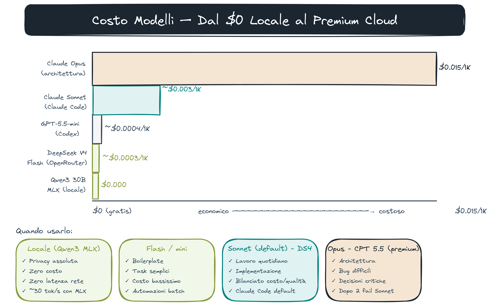
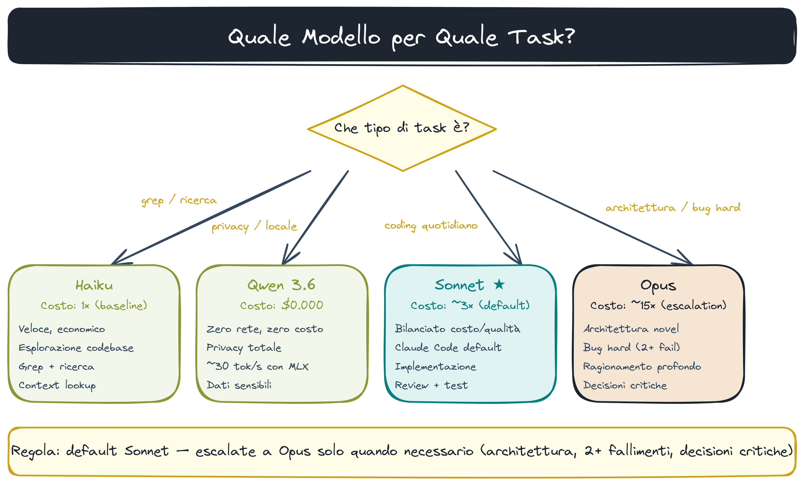

# Modelli Alternativi in Claude Code

> **Key message:** Non sei vincolato a un provider né a un tool — la stessa primitiva (skill, hook, rule) gira su Claude Code (Claude), Codex (GPT), OpenCode (modelli open). La scelta del modello è una decisione economica e di privacy, non tecnica.

## Panoramica — Tool e Modelli

| Tool        | Modelli default                | Modelli alternativi via config                   | Costo         |
| ----------- | ------------------------------ | ------------------------------------------------ | ------------- |
| Claude Code | Claude Haiku/Sonnet/Opus       | Qualsiasi OpenAI-compatible (Ollama, OpenRouter) | Pay-per-token |
| Codex       | GPT-4.1-mini, o3               | OpenRouter, Azure OpenAI                         | Pay-per-token |
| OpenCode    | Qwen3, DeepSeek, Llama         | Qualsiasi modello locale o API                   | Infra only    |
| Ollama      | Qwen3, Mistral, Llama (locale) | Qualsiasi GGUF/MLX                               | $0/token      |

## Perché Modelli Alternativi

- Costo: Qwen 3 locale = $0/token (solo infra)
- Privacy: nessun dato fuori dalla macchina
- Sperimentazione: confronto qualità/velocità per task specifici
- Ridondanza: fallback quando API providers hanno outage

## Qwen 3 Locale via Ollama

### Modelli disponibili

| Modello         | Parametri           | Quantizzazione | VRAM  | Quando usarlo             |
| --------------- | ------------------- | -------------- | ----- | ------------------------- |
| `qwen3:8b`      | 8B                  | Q4_K_M         | ~6GB  | Task semplici, velocità   |
| `qwen3:27b`     | 27B dense           | Q4_K_M         | ~20GB | Bilanciato qualità/costo  |
| `qwen3:30b-a3b` | 30B MoE (3B attivi) | Q4_K_M         | ~8GB  | Qualità con VRAM limitata |

### Setup

```bash
# Installa Ollama
curl -fsSL https://ollama.ai/install.sh | sh

# Scarica modello
ollama pull qwen3:30b-a3b

# Verifica
ollama run qwen3:30b-a3b "ciao"
```

### Configurazione in Claude Code

`~/.claude/settings.local.json` (template: [`examples/settings-local.example.json`](../examples/settings-local.example.json)):

```json
{
  "env": {
    "ANTHROPIC_BASE_URL": "http://localhost:11434/v1",
    "ANTHROPIC_API_KEY": "ollama"
  }
}
```

Oppure via OpenRouter (vedi sotto) per routing unificato.

> **[demo]** `claude-gemma4` → Claude Code punta Gemma 4 31B via Ollama :4000. `claude-gptoss` → GPT-OSS 20B via Ollama :4000. "La stessa skill `/pre-commit` gira su GPT-OSS locale senza modificare una riga."

## DeepSeek V4 Flash via OpenRouter

DeepSeek V4 Flash = modello denso ottimizzato per inferenza veloce. A **2-4 bit** via OpenRouter è competitivo con Claude Sonnet sul rapporto qualità/costo.

### Setup OpenRouter

```bash
export OPENROUTER_API_KEY=sk-or-v1-...
```

### Configurazione Claude Code

`~/.claude/settings.local.json` (template: [`examples/settings-local-openrouter.example.json`](../examples/settings-local-openrouter.example.json)):

```json
{
  "env": {
    "ANTHROPIC_BASE_URL": "https://openrouter.ai/api/v1",
    "ANTHROPIC_API_KEY": "$OPENROUTER_API_KEY"
  }
}
```

Modelli consigliati su OpenRouter:

- `deepseek/deepseek-v4-flash` — veloce, economico
- `qwen/qwen3-30b-a3b:free` — gratuito per test

> **[demo]** `make proxy-deepseek` → proxy OpenRouter/DeepSeek su localhost:4002. `claude-deepseek` → Claude Code punta DeepSeek V4 Flash via :4002. Mostra il pricing reale in dashboard OpenRouter — costo ~10x inferiore a Claude Sonnet.

> **[fonte]** [2025 LLM Year in Review](https://karpathy.bearblog.dev/year-in-review-2025/) — Karpathy analizza DeepSeek R1 come paradigm shift open-source ("Llama = Linux") e il suo impatto sul routing tra modelli proprietari e open.

### Configurazione Codex

`~/.codex/config.toml` (template: [`examples/codex-config.example.toml`](../examples/codex-config.example.toml)):

```toml
[providers.openrouter]
base_url = "https://openrouter.ai/api/v1"
api_key_env = "OPENROUTER_API_KEY"

[model]
provider = "openrouter"
name = "deepseek/deepseek-v4-flash"
```

## Routing Intelligente



Il pattern ottimale non è scegliere un modello per tutto:

| Task                  | Modello                    | Perché                      |
| --------------------- | -------------------------- | --------------------------- |
| Esplorazione/grep     | Claude Haiku               | Veloce, economico           |
| Implementazione       | Claude Sonnet / Qwen 3 27B | Bilanciato                  |
| Architettura/bug hard | Claude Opus                | Ragionamento profondo       |
| Codice boilerplate    | DeepSeek V4 Flash          | Economico, abbastanza buono |
| Locale/privacy        | Qwen 3 30B-A3B             | Zero costo, zero rete       |

> **[fonte]** [Measuring the Impact of Early-2025 AI on Experienced Open-Source Developers](https://metr.org/blog/2025-07-10-early-2025-ai-experienced-os-dev-study/) — dati RCT reali su quale tipo di task beneficia davvero dall'AI: guida concreta per decidere quale modello assegnare a quale step del routing.

> **[fonte]** [How AI Is Transforming Work at Anthropic](https://www.anthropic.com/research/how-ai-is-transforming-work-at-anthropic) — lo shift da debugging a feature implementation (14% → 37%) mostra empiricamente perché modelli leggeri (Haiku/Flash) coprono l'esplorazione e quelli pesanti servono solo per architettura e bug complessi.

## opusplan — Routing Automatico Opus/Sonnet



`opusplan` è una modalità di routing built-in in Claude Code. Si abilita con una riga in `settings.json`:

```json
{ "model": "opusplan" }
```

**Cosa fa:** Opus pianifica (15× costo), Sonnet implementa (3× costo). Risparmio tipico: 60-80% rispetto a tutto-Opus su sessioni lunghe.

```
Explore × Haiku → Plan × Opus → Implement × Sonnet → Output
```

**Nel nostro setup:** già configurato in `~/.claude/settings.json`. Non serve fare niente.

Regola pratica: sempre attivo per refactoring, nuove feature, debugging complesso. Non aggiunge overhead su quick fix a una riga.

> Fonte: [MindStudio — Save tokens with Claude Code Opus Plan Mode](https://www.mindstudio.ai/blog/save-tokens-claude-code-opus-plan-mode)

> **[fonte]** [Andrej Karpathy: Software Is Changing (Again)](https://www.youtube.com/watch?v=LCEmiRjPEtQ) — introduce il concetto di "autonomy slider" e LLM come OS, framework teorico per capire perché il routing intelligente tra modelli è una scelta di architettura, non solo di costo.

## OpenCode — La Terza CLI

OpenCode è una CLI open-source alternativa a Claude Code e Codex. Usa modelli open (Qwen3, DeepSeek, Llama) ed è pensata per chi vuole il pieno controllo della stack.

**Installazione:**

```bash
# Via npm (richiede Node 18+)
npm install -g opencode-ai

# Oppure via brew
brew install opencode-ai/tap/opencode
```

**Configurazione base** (`~/.opencode/config.toml`):

```toml
[model]
provider = "ollama"
name = "qwen3:30b-a3b"

# Oppure via OpenRouter per modelli cloud
[providers.openrouter]
base_url = "https://openrouter.ai/api/v1"
api_key_env = "OPENROUTER_API_KEY"
```

**Compatibilità:** OpenCode supporta le stesse primitive di Claude Code — skills come file Markdown, hooks Python, rules Markdown. Lo stesso file `pre-commit.md` gira su tutti e tre i tool senza modifiche.

> **[demo]** Avvia il modello su Studio via SSH (dal repo llm-ops-v1): `make mlx-gpt-oss` (GPT-OSS 20B → :8080), `make mlx-27b` (Qwen3.6-27B → :8080), `make mlx-gemma4` (Gemma 4 31B → :8080). Poi `make proxy-mlx` → proxy Studio MLX su localhost:4001. Infine `claude-mlx` → Claude Code punta GPT-OSS 20B via :4001. Il punto: `/pre-commit` e `/review gate` girano su tutti i tool senza modificare una riga.
