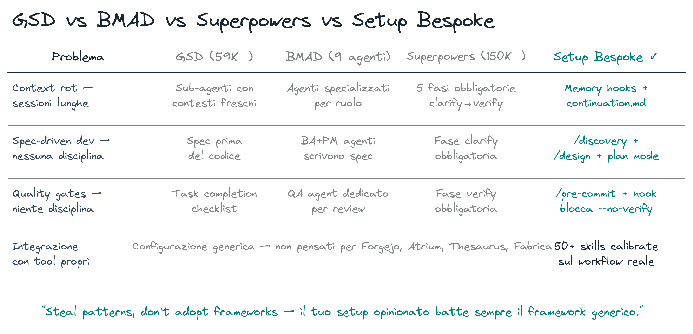

# SDLC vs Framework Esterni — GSD, BMAD, Superpowers

> **Key message:** I framework risolvono problemi reali ma coprono 2-3 layer su 7. Il nostro SDLC li copre tutti. Confronta e scegli.

## L'Architettura di un Sistema Agentico — 7 Layer

Prima di confrontare i framework, il modello concettuale che li unifica.

> Fonte: [L'Agente Non Ha Una Forma](https://pinperepette.github.io/signal.pirate/articoli/l-agente-non-ha-una-forma.html?t=d)

Un sistema agentico completo attraversa 7 layer:

| Layer | Cosa fa |
|-------|---------|
| 1. Input / Contesto | Cosa entra nel sistema (utente, dati, trigger) |
| 2. Context Construction | Come si costruisce la conoscenza: RAG, CAG, Knowledge Graph |
| 3. Orchestrazione | Chi decide e come: single agent, planner-executor, multi-agent |
| 4. Tools / Azioni | API, DB, esecuzione codice, altri LLM |
| 5. Output / Risultati | Testo, azioni, aggiornamenti di stato |
| 6. Valutazione e Controllo | Guardrail: validazione, sicurezza, autocorrezione |
| 7. Memoria | Trasversale: sessione, long-term, cache condivisa |

**L'insight chiave:** query diverse attivano subset diversi di layer. Una ricerca semplice ne attraversa 3. Una feature complessa ne attraversa 7. Stesso sistema, percorsi diversi.

> **[demo]** show the 7-layer image — what happens in the live session

> **[fonte]** [LLM Powered Autonomous Agents](https://lilianweng.github.io/posts/2023-06-23-agent/) — Lilian Weng: il modello tri-componente (Planning, Memory, Tool Use) è la base teorica che mappa esattamente sui layer 2 (Context Construction), 3 (Orchestrazione) e 7 (Memoria).

## I Framework — Cosa Risolvono (e Cosa Non Danno)

### GSD — Get Shit Done (59K+ stelle)

**Problema:** context rot. Il modello perde coerenza su sessioni lunghe.

**Soluzione:** sub-agenti con contesti freschi, spec scritte prima del codice, stato in file Markdown.

**Layer coperti:** 2 (Context Construction) + 3 (Orchestrazione) + 7 (Memoria, parziale)

**Cosa vale:** scrivi la spec prima, usa sub-agenti per task isolabili, lo stato vive in file non nella history.

### BMAD — Breakthrough Method for Agile AI-Driven Development

**Problema:** un agente generalista non ha ruoli. Nessuna separazione tra chi pensa e chi esegue.

**Soluzione:** 9 agenti specializzati (BA, PM, UX, Architect, Dev, QA…) in sequenza su epic → story → sprint → PR.

**Layer coperti:** 3 (Orchestrazione, con ruoli) + 6 (QA come ruolo esplicito)

**Cosa vale:** separa planning da execution, il ruolo QA deve essere esplicito, la retrospettiva automatizzata evita regressioni.

### Superpowers (150K+ stelle, plugin Anthropic ufficiale)

**Problema:** Claude inizia a scrivere codice senza aver capito il problema.

**Soluzione:** 5 fasi obbligatorie — clarify → design → plan → code → verify. Non puoi saltarle.

**Layer coperti:** 1 (Input, con clarify) + 6 (verify obbligatorio)

**Cosa vale:** la fase clarify è non negoziabile, il verify è una gate non un'opzione, nessun codice senza piano approvato.

> **[demo]** GSD / BMAD / Superpowers walkthrough — show each framework, highlight what layer it covers and what it leaves out

> **[fonte]** [Building Effective Agents](https://www.anthropic.com/engineering/building-effective-agents) — Anthropic: i pattern workflow (prompt chaining, routing, parallelization, orchestrator-workers, evaluator-optimizer) sono le implementazioni concrete dei layer 3 (Orchestrazione) e 6 (Valutazione e Controllo).

## Il Nostro SDLC — Tutti e 7 i Layer

| Layer | Implementazione SDLC |
|-------|---------------------|
| 1. Input | `SessionStart` hook: git state, `continuation.md`, issue aperti |
| 2. Context (CAG) | `CLAUDE.md` + `rules/` (statici) + `continuation.md` (dinamico) |
| 2. Context (RAG) | `/memory recall` → SQLite FTS5 + Thesaurus semantic |
| 3. Orchestrazione | Slash command + `/progress` (router) + skill chaining + hooks |
| 4. Tools | 40+ skills, companion dispatch (Codex/Gemini), CLI, servizi |
| 5. Output | Codice, commit, PR, deploy, wiki, report |
| 6. Guardrail | hooks → TDD → `/security-verify` → `/review gate` → CI → human gate |
| 7. Memoria | `continuation.md` + auto-memory + SQLite + Thesaurus |

> **[fonte]** [Effective Context Engineering for AI Agents](https://www.anthropic.com/engineering/effective-context-engineering-for-ai-agents) — Anthropic: approfondisce il layer 2 — context rot, CAG vs RAG, just-in-time retrieval e progressive disclosure come strategie concrete di Context Construction.

> **[demo]** reflection loop live — `/spec --issue N` → `/implementation --fast` → `/review gate` (BLOCK) → `/fix` → `/review gate` (PASS) → `/pre-commit`
> **[demo]** pipeline FatturaPA — 4 SDK (Claude Agent SDK, Codex, PydanticAI, LangGraph) sullo stesso caso: [`docs/demos/demo-fatturapa-parser.md`](demos/demo-fatturapa-parser.md).

> **[fonte]** [karpathy/autoresearch](https://github.com/karpathy/autoresearch) — Ralph Loop: implementazione reale del layer 6 come loop autonomo (evaluator-optimizer), con `program.md` come gate di controllo umano sul ciclo di autocorrezione.

## Confronto Diretto

| Bisogno | GSD / BMAD / Superpowers | Il nostro SDLC |
|---------|--------------------------|----------------|
| Context management | File Markdown, sub-agenti freschi | Memory hooks + `continuation.md` + SQLite FTS5 |
| Ruoli specializzati | 9 agenti BMAD | Plan (opus) + Explore (haiku) + general (sonnet) |
| Disciplina di processo | 5 fasi Superpowers | Plan mode + `rules/tdd.md` + `/pre-commit` |
| Spec-driven dev | GSD spec files | `/discovery` → `/design` → `/spec` → `/implementation` |
| Reflection loop | Manuale | `/review gate` → `/fix` → loop → `/pre-commit` |
| Anti-context-rot | GSD sub-agenti | `/diagnose` (fresh 200k) + `/memory recall` |
| Guardrail a 6 layer | Nessuno | hooks (PreToolUse) + TDD + security scan + companion + CI + human gate |
| Autonomy loop | Nessuno | `/loop` nativo + ralph-loop.sh (→ vedi `02-harnessing.md`) |

**La differenza sostanziale:** i framework sono generici e distribuiti. Il SDLC è calibrato — hook Python che bloccano meccanicamente, pipeline non bypassabile, companion cross-model che non si auto-reviewano.

> **[demo]** confronto live with `16-framework-comparison.png` — per ogni riga, indica il gap nei framework e la soluzione nel SDLC; concludi sulla riga guardrail

## Il Ruolo Che Cambia

Da oggi non siete writer — siete **specifier, orchestrator, reviewer**.

Cosa rimane umano: le decisioni architetturali, il giudizio sulla qualità, la responsabilità del prodotto.

Cosa cambia: non si scrive codice riga per riga. Si scrivono spec e si reviewano output. La competenza si sposta dall'implementazione all'orchestrazione critica.

Regola sul blast radius: più il task è irreversibile o va a clienti, più la struttura è giustificata. Un prototipo esplorativo non ha bisogno di `/spec`. Un deploy in produzione sì.

> **[demo]** `/registry` chiusura — lista tutte le skill, "Scegliate voi cosa usare. Ma sapete cosa c'è sotto."
