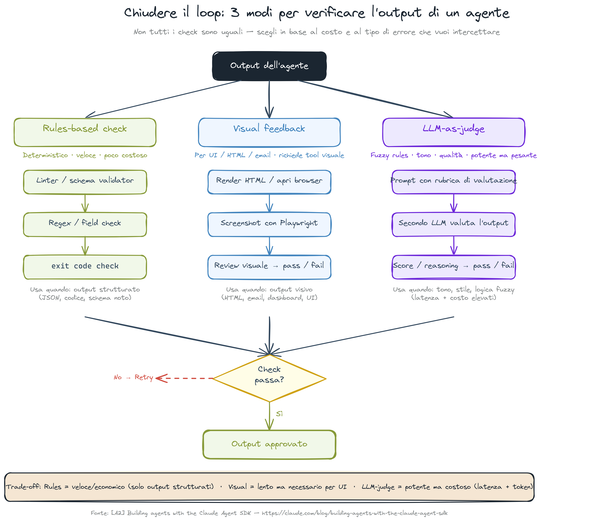

# Mappa delle Skill — Tier di Utilizzo

Riferimento pratico per l'uso quotidiano. 40+ skill disponibili — la maggior parte delle sessioni ne usa 5-10.

## Tier 1 — Quotidiano (90% del lavoro)

| Skill | Quando |
|-------|--------|
| `/implementation` | Scrivere codice nuovo (TDD, branch, opusplan) |
| `/pre-commit` | Validare prima di committare |
| `/ship` | Commit + push + apertura PR |
| `/fix` | Bug fix con minima cerimonia |
| `/quick` | Modifiche atomiche, nessuna pianificazione |

## Tier 2 — Settimanale

| Skill | Quando |
|-------|--------|
| `/review changes` | Dopo l'implementazione, prima del pre-commit |
| `/release` | Bump versione, changelog, tag semantici |
| `/health` | Audit complessivo del progetto |
| `/deps` | Verifica freschezza dipendenze e CVE |
| `/security-verify scan` | Prima di ogni commit (gate obbligatorio) |
| `/progress` | "Qual è il prossimo passo?" |
| `/diagnose` | Root cause ignota, serve investigazione |

## Reflection Loop Chain



La sequenza standard post-implementazione:

```
/review gate  →  BLOCK  →  /fix  →  /review gate  →  PASS  →  /pre-commit  →  /ship
```

Se il loop non converge: `/diagnose` — spawna un subagente con contesto fresco, non vede la sessione corrente.

## Tier 3 — On-Demand (per dominio)

**Discovery e Pianificazione**: `/discovery`, `/design`, `/spec`, `/story`
**Memoria**: `/memory recall`, `/memory condense`
**Infra**: `/docker-audit`, `/ci-setup`, `/deploy`, `/ops`
**Qualità**: `/quality-check`, `/techdebt`, `/map-codebase`

## Per Codex e altri agenti

Gli stessi tier si applicano. Quando si delega un task a un agente, si parte dal Tier 1. Si scala a Tier 2/3 solo quando il task lo richiede.

I contratti di ogni skill (input, output, precondizioni) sono documentati nel rispettivo `SKILL.md`.
