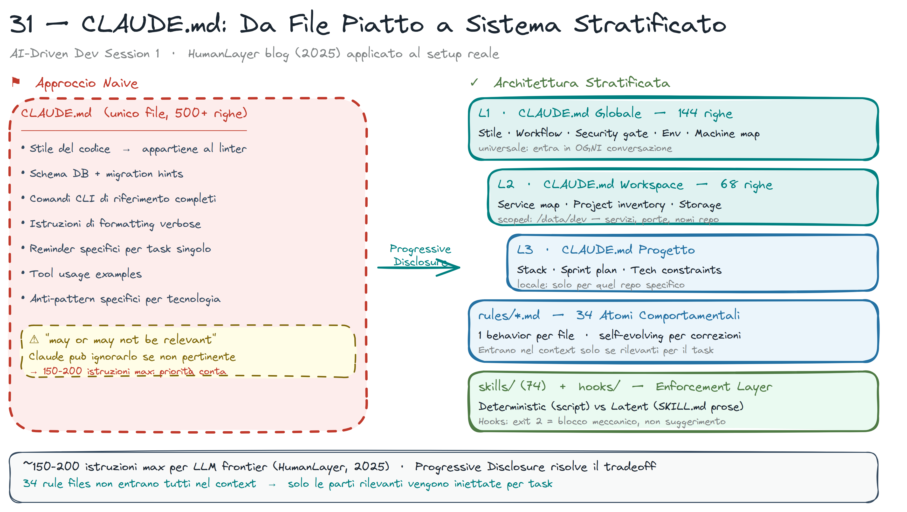
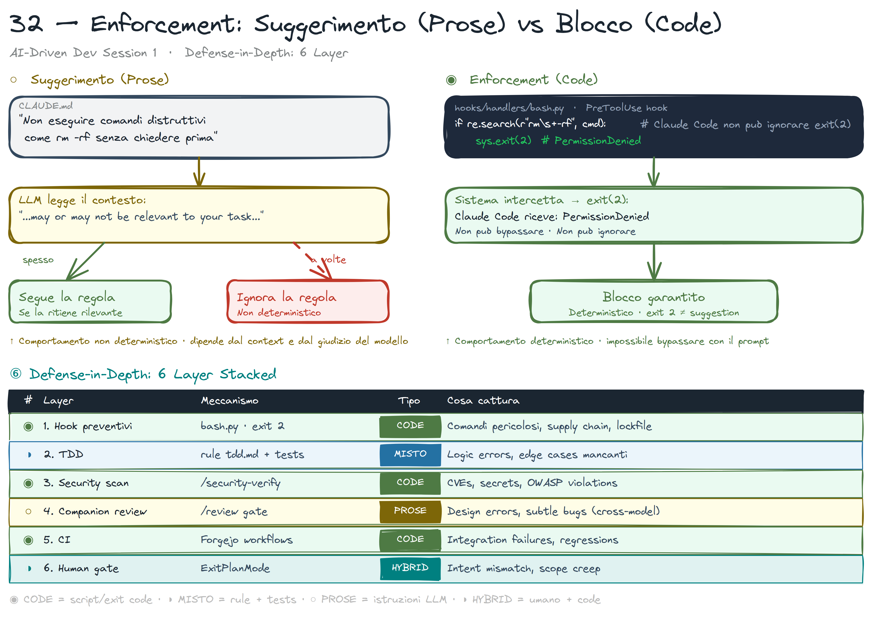

# Come Scrivere CLAUDE.md e AGENTS.md

> **Key message:** CLAUDE.md non è documentazione — è il system prompt persistente del tuo agente. Ogni riga ha un costo in ogni sessione.

## Il Principio Base

CLAUDE.md non è documentazione. È il **system prompt persistente** del tuo agente — quello che legge prima di ogni sessione, prima ancora di vedere la tua richiesta.

Ogni riga ha un costo: entra nel context window ad ogni conversazione. Scrivi solo quello che deve essere vero in ogni sessione, non quello che vale per un task specifico.



## L'Architettura a Layer

Non un file unico piatto — un sistema a layer che si carica on-demand:

```
~/.claude/CLAUDE.md          # Globale: stile, macchina, sicurezza
                               # Entra in OGNI sessione

/dev/CLAUDE.md               # Workspace: progetti attivi, struttura
                               # Entra quando sei in /dev

<repo>/CLAUDE.md             # Progetto: stack, workflow, regole specifiche
                               # Entra quando sei nel repo

~/.claude/rules/tdd.md       # Rule atomica: TDD obbligatorio
~/.claude/rules/security.md  # Rule atomica: gate sicurezza
                               # Entrano solo quando pertinenti al task
```

**La differenza tra naive e stratificato:**

- Naive: un CLAUDE.md da 500+ righe con tutto — stile, schema DB, comandi CLI, regole team
- Stratificato: root CLAUDE.md < 150 righe, il resto in `rules/` atomiche caricate on-demand

Un task di frontend non carica `alembic-asyncpg.md`. Un commit non carica `frontend-verification.md`. La progressive disclosure trasforma 500 istruzioni in 20-30 rilevanti per questo task.

> **[demo]** show CLAUDE.md layer structure — what happens in the live session

> **[fonte]** [Effective Context Engineering for AI Agents](https://www.anthropic.com/engineering/effective-context-engineering-for-ai-agents) — approfondisce il concetto di progressive disclosure e context rot: il CLAUDE.md stratificato a layer è la risposta diretta al problema n² che emerge quando tutto entra nel context window ad ogni sessione.

## Cosa Va Dove

| Contenuto | Dove |
|-----------|------|
| Stile di risposta (tono, lunghezza) | `~/.claude/CLAUDE.md` globale |
| Macchina, env, path locali | `~/.claude/CLAUDE.md` globale |
| Security gate (sempre attivo) | `~/.claude/CLAUDE.md` globale |
| Stack del progetto | `<repo>/CLAUDE.md` |
| Workflow del progetto | `<repo>/CLAUDE.md` |
| Regole specifiche (TDD, naming) | `<repo>/.claude/rules/` |
| Task-specific guidance | Skills (`~/.claude/skills/`) |

> **[fonte]** [Claude Prompting Best Practices](https://platform.claude.com/docs/en/build-with-claude/prompt-engineering/claude-prompting-best-practices) — chiarisce il "right altitude" del system prompt: la stessa tensione tra specificità e flessibilità che si applica al CLAUDE.md si applica a ogni istruzione persistente in un agente.

## Suggerimento vs Enforcement



La distinzione più importante:

```markdown
# Nel CLAUDE.md (suggerimento)
Non eseguire comandi distruttivi come rm -rf senza chiedere prima.
```

```python
# In bash.py (blocco meccanico)
if "rm -rf" in command:
    sys.exit(2)  # PermissionDenied — non può essere ignorato
```

Il modello può ignorare un'istruzione nel CLAUDE.md se la giudica "not relevant to your task". L'`exit 2` in un hook non si ignora — è un blocco di sistema.

**Regola:** tutto ciò che non puoi permetterti venga ignorato va in un hook, non nel CLAUDE.md.

> **[demo]** show suggerimento vs enforcement — what happens in the live session

> **[fonte]** [AI-assisted Coding for Teams That Can't Get Away With Vibes](https://blog.nilenso.com/blog/2025/05/29/ai-assisted-coding/) — Nilenso descrive RULES.md e coding standards come prerequisiti strutturali per l'AI: è la stessa idea dell'architettura a layer applicata a un team.

## Come Scrivere AGENTS.md (Codex)

`~/.codex/instructions.md` è l'equivalente di CLAUDE.md per Codex. Stesse regole:

- < 300 righe nel file globale
- Approvazione policy in `config.toml`, non nel testo
- Usa `hooks.json` per enforcement meccanico

La stessa skill `/pre-commit` scritta in Markdown gira su entrambi senza modifiche — il contratto è il formato, non il tool.

> **[demo]** show AGENTS.md for Codex — what happens in the live session

> **[fonte]** [Writing effective tools for AI agents](https://www.anthropic.com/engineering/writing-tools-for-agents) — approfondisce come le descrizioni dei tool nel system prompt funzionano come un'estensione del CLAUDE.md: token efficiency, namespacing e prompt-engineering delle descrizioni sono la stessa disciplina applicata agli strumenti.

## Template Minimo Funzionante

```markdown
# Project Name

## Stack
- Python 3.12, uv, FastAPI
- PostgreSQL (asyncpg), Redis

## Workflow
- TDD: test prima dell'implementazione, sempre
- Commit: conventional commits (feat/fix/docs/chore)
- Branch: feature/<issue>-slug
- Security: /security-verify scan prima di ogni commit

## Non fare
- Non aggiungere dipendenze senza giustificazione
- Non usare --no-verify
- Non committare senza /pre-commit verde
```

Questo è sufficiente per il 90% dei progetti. Il resto va nelle rules atomiche.

## Checklist Prima di Pubblicare

- [ ] Root CLAUDE.md < 200 righe?
- [ ] Ogni riga è utile in OGNI sessione (non solo per task specifici)?
- [ ] Le regole non-negoziabili sono in hook, non solo in prosa?
- [ ] Le task-specific guidance sono in `rules/` o `skills/`, non nel globale?
- [ ] Nessun dato sensibile (path personali, hostname, token) nel file committato?
