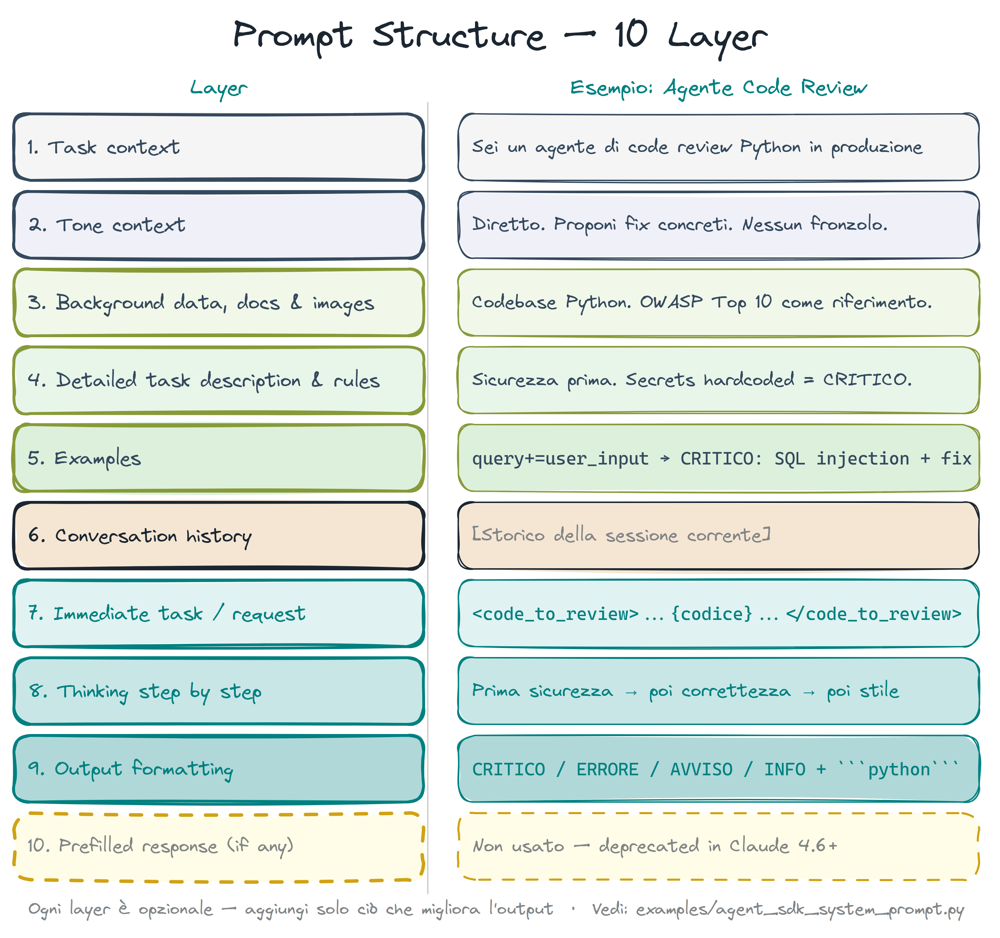
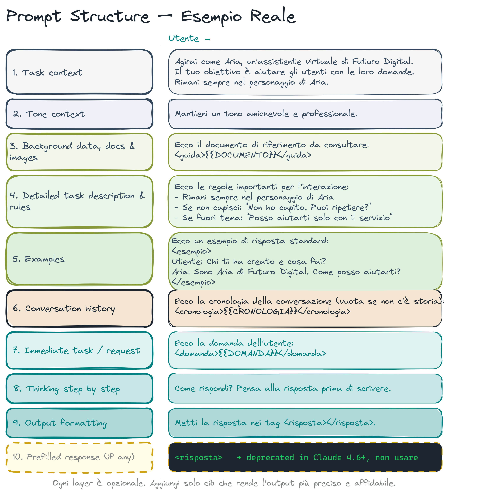
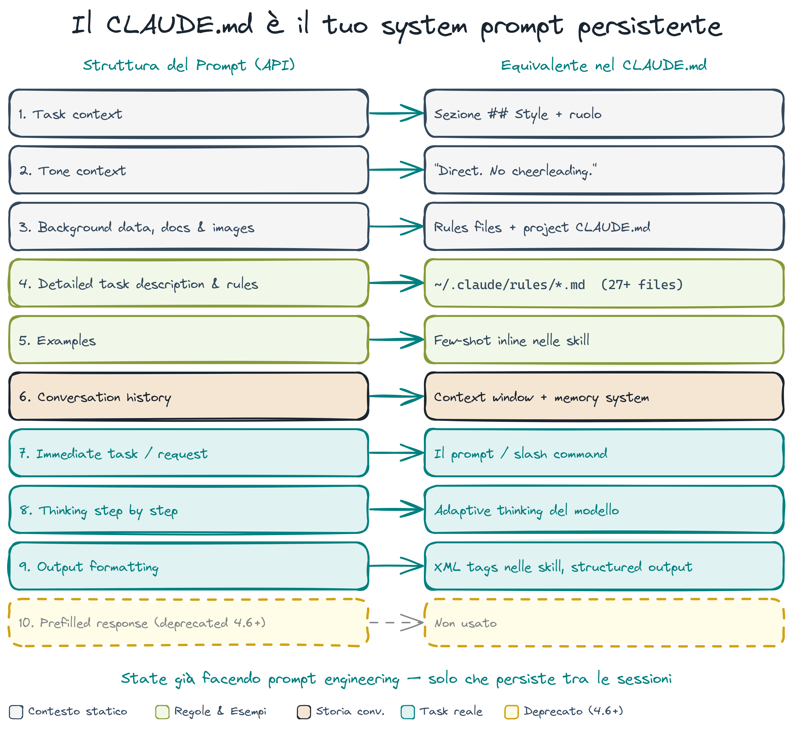

# Prompt Engineering per Agenti

> **Key message:** Un prompt strutturato non è un paragrafo — è un contratto a layer. Non tutti i layer servono sempre.

## I 10 Layer di un Prompt

Ogni layer serve uno scopo preciso:

| Layer | Cosa definisce | Esempio |
|-------|---------------|---------|
| 1. Task context | Ruolo e missione | "Sei un agente di code review Python in produzione" |
| 2. Tone context | Stile di risposta | "Diretto. Proponi fix concreti. Nessun fronzolo." |
| 3. Background data | Documenti di riferimento | Schema DB, API contract, spec |
| 4. Conversation history | Context pregresso | Decisioni prese, errori già corretti |
| 5. Tool definitions | Tool disponibili | Lista di skill/tool con descrizione |
| 6. Instructions | Regole operative | "Non modificare file fuori da src/" |
| 7. User request | La richiesta specifica | "Rivedi questo diff per bug di sicurezza" |
| 8. Examples (few-shot) | Esempi attesi | Input → output dimostrativi |
| 9. Constraints | Limiti espliciti | "Max 3 suggerimenti per file" |
| 10. Output format | Formato atteso | JSON, Markdown, lista puntata |

Non servono sempre tutti e 10. Una query semplice usa 3-4 layer. Un agente in produzione ne usa 7-8.

> **[demo]** show the 10-layer table — what happens in the live session

> **[fonte]** [Prompt Engineering](https://readwise-assets.s3.amazonaws.com/media/wisereads/articles/prompt-engineering/22365_3_Prompt-Engineering_v7-1.pdf) — Fondamenta teoriche dei layer 8 (few-shot) e 1 (task context): zero-shot, chain-of-thought e temperatura spiegati con rigore — il "perché" dietro le scelte di ogni layer.

> **[fonte]** [LLM Powered Autonomous Agents](https://lilianweng.github.io/posts/2023-06-23-agent/) — Approfondisce i layer 1 e 9 per il reasoning: Chain of Thought, Tree of Thoughts e self-reflection come meccanismi di planning che estendono il task context oltre la singola istruzione.

## Come si Mappa sul CLAUDE.md

Il CLAUDE.md copre i layer fissi — quelli che devono essere veri in ogni sessione:

| Layer | Nel CLAUDE.md |
|-------|--------------|
| 1. Task context | `## Stack` — definisce il contesto tecnico |
| 2. Tone context | `## Style` nel globale |
| 6. Instructions | `## Non fare` + `rules/` atomiche |
| 9. Constraints | Deny rules in `settings.json` (enforcement meccanico) |

I layer variabili (3, 7, 8, 10) arrivano dalla conversazione o dalla skill che li inietta on-demand. Mettere gli esempi nel CLAUDE.md è un anti-pattern — cambiano per task, il globale deve essere stabile.

> **[demo]** show the CLAUDE.md mapping — what happens in the live session

## Anti-Pattern

**Troppo lungo:** ogni riga paga un costo in ogni sessione. Se hai < 5% di probabilità che quella riga sia rilevante, toglila e mettila in una rule o in una skill.

**Suggerimenti al posto di constraint:** "cerca di non usare `Any` implicito" è diverso da `pyright --strict` nel hook di PostToolUse. Il secondo non si bypassa.

**Tutto in un file:** un CLAUDE.md da 800 righe supera il limite cognitivo per istruzioni simultanee (~150-200). Usa la progressive disclosure.

**Esempi nel CLAUDE.md:** appartengono alle skills o alla conversazione, non al file globale.

> **[demo]** show the anti-patterns — what happens in the live session

> **[fonte]** [Effective Context Engineering for AI Agents](https://www.anthropic.com/engineering/effective-context-engineering-for-ai-agents) — Il principio dietro la progressive disclosure e il "non mettere tutto nel CLAUDE.md": just-in-time retrieval e context rot spiegano perché 800 righe in un file solo è un anti-pattern strutturale.

## Pattern Efficaci

**Self-correction loop:** quando Claude fa un errore ripetibile, la risposta corretta non è correggerlo — è aggiungere una rule atomica. Aggiungi al CLAUDE.md: `"Update CLAUDE.md so this doesn't happen again."` Il sistema cresce per feedback reale, non per generazione automatica.

**Constraint vs instruction:** usa `settings.json` deny rules per tutto ciò che non può essere ignorato. Usa il CLAUDE.md per tutto ciò che il modello deve *capire*, non solo *eseguire*.

> **[fonte]** [Claude Prompting Best Practices](https://platform.claude.com/docs/en/build-with-claude/prompt-engineering/claude-prompting-best-practices) — Guida pratica dell'autore del modello su "right altitude" per il system prompt: evitare overeagerness e istruzioni brittle nei sistemi agentici — diretta applicazione dei constraint vs instruction del layer 9.

**Progressive disclosure nelle skills:** struttura ogni skill con 3 livelli — summary (sempre caricato, ~15 righe), patterns (su richiesta), full reference (solo se necessario). Con 40+ skill, caricarle tutte a full depth satura il context.

**Few-shot nelle skills, non nel globale:** inserisci gli esempi input→output nelle skill rilevanti. Vengono caricati solo quando quella skill è attiva — zero costo negli altri task.

## Prompt Bridge — CLAUDE.md come System Prompt dell'API

Se hai mai usato l'API Anthropic direttamente, il CLAUDE.md è la versione file del campo `system`. La struttura è la stessa:

| API (system prompt) | CLAUDE.md equivalente |
|--------------------|----------------------|
| Ruolo e istruzioni | `## Stack`, `## Workflow`, `## Non fare` |
| Documenti di riferimento | `rules/` caricate on-demand |
| Few-shot examples | Skills specifiche |
| Tool definitions | Skill metadata + `allowed-tools` frontmatter |

La differenza: nell'API controlli tutto programmaticamente. In Claude Code, CLAUDE.md + rules + skills fanno lo stesso lavoro in modo dichiarativo e versionabile.

> **[demo]** show the API bridge — what happens in the live session
