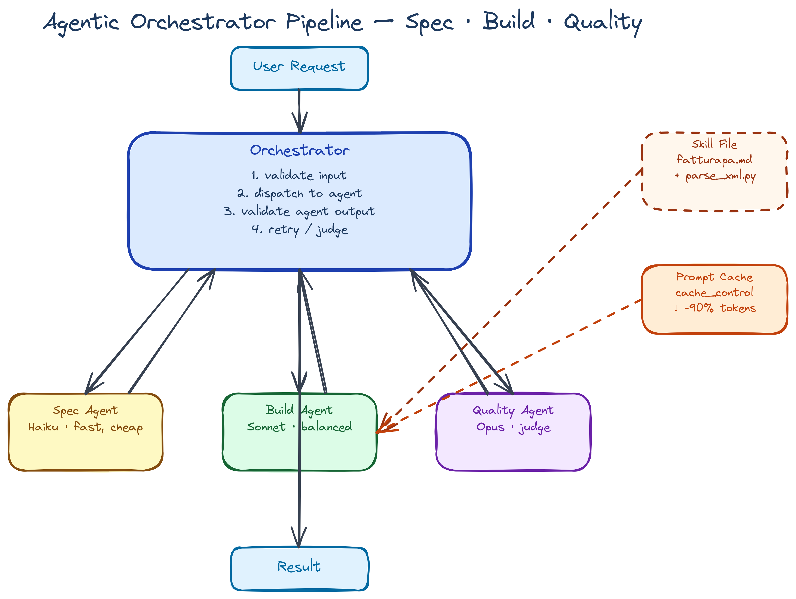

# Confronto pratico: Claude Agent SDK · Codex SDK (Python) · PydanticAI · LangGraph

**Caso d'uso**: pipeline a 3 agenti in serie per parsare fatture FatturaPA (XML).

1. **Spec Agent** → scrive le specifiche
2. **Build Agent** → implementa il parser usando una *skill* su FatturaPA (caricata con YAML frontmatter)
3. **Quality Agent** → esegue `ruff` + `mypy` e riporta gli issue

L'orchestratore gestisce il passaggio fra agenti, valida gli output e gestisce gli errori.

---

## 1. Schema didattico

### 1.1 Architettura della pipeline



### 1.2 Elementi base da configurare per ogni agente

| Elemento | Cosa fa | Esempio |
|----------|---------|---------|
| **System prompt** | Definisce ruolo e regole comportamentali dell'agente | "Sei un quality engineer, riporta issue trovati" |
| **Model** | Sceglie il modello (potenza vs costo) | Haiku per task semplici, Sonnet per medi, Opus per complessi |
| **Tools / allowed_tools** | Strumenti che l'agente può usare (Read, Write, Bash...) | `["Read", "Write", "Bash"]` |
| **Max turns** | Limite anti-loop e anti-costo | 5-10 normalmente |
| **Permission mode** | Quanto chiede prima di scrivere/eseguire | `acceptEdits`, `default`, `bypassPermissions` |
| **CWD** | Directory di lavoro condivisa fra agenti | `/tmp/invoice_parser` |
| **Cache control** | Marca porzioni di prompt come riutilizzabili (skill, system prompt lungo) | `cache_control={"type":"ephemeral"}` |
| **Output schema** | Forza output strutturato e tipato (Pydantic/JSON schema) | `BaseModel` con campi tipati |

### 1.3 Modelli e quando sceglierli

| Task | Modello consigliato | Perché |
|------|---------------------|--------|
| Spec writing (creativo ma corto) | **Haiku** (`claude-haiku-4-5`) | Veloce, economico, qualità sufficiente |
| Build / coding complesso | **Sonnet** (`claude-sonnet-4-6`) | Bilanciamento qualità/costo per code generation |
| Architettura / refactoring critico | **Opus** (`claude-opus-4-7`) | Massimo ragionamento, costo alto |
| Quality / linting check | **Sonnet** | Servono ragionamento e precisione, ma non Opus |

> Per OpenAI: `gpt-5.5` o 'gpt-5.4-mini'.

### 1.4 API token vs bundled binary

Due modi distinti di chiamare un agente:

- **API mode** (Claude Agent SDK, PydanticAI, LangGraph): autenticazione via `ANTHROPIC_API_KEY` o `OPENAI_API_KEY`, il SDK fa chiamate HTTP. Pagamento a token. Senza limiti di rate plan-based.
- **Bundled binary mode** (Codex SDK): l'SDK Python wrappa il binary `codex` installato localmente. L'autenticazione può essere via `CODEX_API_KEY` o via la sessione del CLI (login OAuth ChatGPT). Eredita i limiti del piano ChatGPT del bundled login.

```python
# Pseudo-detection del mode
import os

USE_BUNDLED = os.getenv("CODEX_BUNDLED", "false").lower() == "true"

if USE_BUNDLED:
    # Modalità bundled: usa il binary locale, login via ChatGPT
    codex = Codex(codex_path_override="/usr/local/bin/codex")
else:
    # Modalità API: pass token esplicito
    codex = Codex(api_key=os.environ["CODEX_API_KEY"])
```

### 1.5 System prompt: CLI vs SDK vs `claude_code` preset

Il system prompt che riceve l'agente cambia radicalmente in base all'interfaccia usata:

| Interfaccia | System prompt | CLAUDE.md | Skill discovery |
|-------------|--------------|-----------|-----------------|
| CLI `claude` | Completo (~269+ token base) | ✅ caricato automaticamente | ✅ `.claude/skills/` |
| Agent SDK (default) | Minimale | ❌ | ❌ |
| Agent SDK + `claude_code` preset | Completo (uguale al CLI) | ❌ serve `settingSources` | ❌ |

Il preset `claude_code` si attiva così:

```python
from claude_agent_sdk import ClaudeAgentOptions

options = ClaudeAgentOptions(
    system_prompt={"type": "preset", "preset": "claude_code"},
    model="claude-sonnet-4-6",
    allowed_tools=["Read", "Write", "Bash"],
)
```

Questo invia al modello le stesse istruzioni operative del CLI (tool usage, git safety, coding guidelines).
Ma CLAUDE.md e le skill in `.claude/skills/` **non vengono caricate** — devono essere iniettate
esplicitamente nel system prompt, come facciamo con `cache_skill_content` nel Build Agent.

> Il preset porta le regole del CLI. La tua configurazione personale rimane fuori.

### 1.5 La "skill" con YAML frontmatter

Una skill è un file markdown con metadati strutturati in testa (YAML frontmatter, stile Anthropic skills / Codex skills) e un corpo che descrive procedura, esempi e — opzionalmente — *script eseguibili allegati*.

```markdown
---
name: fatturapa-parser
description: Parses Italian FatturaPA XML invoices into normalized dicts
version: 1.0.0
allowed_tools:
  - Read
  - Bash
inputs:
  - xml_path: str
outputs:
  - list[dict] with keys: numero, data, piva_cedente, imponibile, iva, totale
scripts:
  - parse_xml.py
---

# FatturaPA Parser Skill

## Background
FatturaPA is the Italian e-invoicing XML format mandated for B2B/B2G.
Root element: `<p:FatturaElettronica>` with namespace
`http://ivaservizi.agenziaentrate.gov.it/docs/xsd/fatture/v1.2`.

## Required fields
| XPath | Output key |
|-------|------------|
| `//DatiGeneraliDocumento/Numero` | numero |
| `//DatiGeneraliDocumento/Data` | data |
| `//CedentePrestatore/DatiAnagrafici/IdFiscaleIVA/IdCodice` | piva_cedente |
| `//DatiRiepilogo/ImponibileImporto` | imponibile |
| `//DatiRiepilogo/Imposta` | iva |
| `//ImportoTotaleDocumento` | totale |

## Helper script
This skill ships with `parse_xml.py` — the build agent can execute it directly
via the Bash tool, no need to re-implement XML parsing from scratch.

## Usage example
```python
from parse_xml import parse_fattura
result = parse_fattura("invoice.xml")
# {"numero": "2026/001", "data": "2026-05-15", ...}
```
```

E lo script `parse_xml.py` allegato:

```python
# parse_xml.py — distributed inside the skill
"""Reference implementation called by the Build Agent via skill loading."""
import xml.etree.ElementTree as ET
from typing import TypedDict

NS = {"p": "http://ivaservizi.agenziaentrate.gov.it/docs/xsd/fatture/v1.2"}

class Invoice(TypedDict):
    numero: str
    data: str
    piva_cedente: str
    imponibile: float
    iva: float
    totale: float

def parse_fattura(xml_path: str) -> Invoice:
    tree = ET.parse(xml_path)
    root = tree.getroot()
    body = root.find(".//FatturaElettronicaBody")
    if body is None:
        raise ValueError(f"Missing FatturaElettronicaBody in {xml_path}")

    header = root.find(".//FatturaElettronicaHeader")
    riepilogo = body.find(".//DatiRiepilogo")

    return {
        "numero": body.findtext(".//DatiGeneraliDocumento/Numero", ""),
        "data": body.findtext(".//DatiGeneraliDocumento/Data", ""),
        "piva_cedente": header.findtext(
            ".//CedentePrestatore/DatiAnagrafici/IdFiscaleIVA/IdCodice", ""
        ),
        "imponibile": float(riepilogo.findtext(".//ImponibileImporto", "0")),
        "iva": float(riepilogo.findtext(".//Imposta", "0")),
        "totale": float(body.findtext(".//ImportoTotaleDocumento", "0")),
    }
```

> **Differenza chiave fra SDK su come trattano la skill**:
> - **Claude Agent SDK** e **Codex SDK** hanno un *discovery* nativo (cartella `.claude/skills/` o `.agents/skills/`), il YAML frontmatter è parsato direttamente, lo script `parse_xml.py` può essere eseguito via tool Bash.
> - **PydanticAI** e **LangGraph** *non* hanno discovery: dobbiamo costruire una classe `Skill` che faccia da equivalente programmatico (vedi sezione 4).

---

## 2. Claude Agent SDK (Python)

```python
"""
Claude Agent SDK — pipeline a 3 agenti per parsing FatturaPA.

- Modello mentale: ogni "agente" è una chiamata `query()` con system prompt,
  tools e modello dedicati. L'orchestratore è codice Python sequenziale.
- La skill viene caricata leggendo il file dalla cartella skills/, e iniettata
  nel system prompt del Build Agent.
- Il caching è esplicito: usiamo `cache_control` per non rifare token billing
  sulla parte di skill che è invariante fra le chiamate.
"""

# pip install claude-agent-sdk
import asyncio
import os
import re
from pathlib import Path
from typing import Literal

from claude_agent_sdk import (
    query,
    ClaudeAgentOptions,
    AssistantMessage,
    TextBlock,
    ResultMessage,
)

# ---------------------------------------------------------------------------
# 0. SETUP: workdir, skill location, modelli
# ---------------------------------------------------------------------------
WORKDIR = Path("/tmp/invoice_parser")
WORKDIR.mkdir(exist_ok=True)
SKILLS_DIR = Path("./skills")  # contiene fatturapa-parser/SKILL.md + parse_xml.py

# Mappatura semantica modello: scegliamo il giusto trade-off per agente
MODELS = {
    "cheap": "claude-haiku-4-5",      # Spec writing: task corto, creativo
    "balanced": "claude-sonnet-4-6",  # Build + Quality: coding/analisi seria
    "powerful": "claude-opus-4-7",    # Fallback per task critici
}

# Modalità di autenticazione: API token (default) vs bundled (richiede CLI installato)
USE_BUNDLED_AUTH = os.getenv("CLAUDE_USE_CLI_AUTH", "false").lower() == "true"
if not USE_BUNDLED_AUTH:
    assert os.getenv("ANTHROPIC_API_KEY"), "Set ANTHROPIC_API_KEY or USE_BUNDLED_AUTH=true"


# ---------------------------------------------------------------------------
# 1. SKILL LOADING: leggi YAML frontmatter + body + (opzionale) script
# ---------------------------------------------------------------------------
def load_skill(skill_name: str) -> dict:
    """
    Carica skill dalla cartella ./skills/<skill_name>/SKILL.md.

    Ritorna {metadata, body, scripts} pronto da iniettare nel system prompt.
    Lo script parse_xml.py NON viene eseguito qui: viene copiato nel WORKDIR
    e l'agente potrà invocarlo via il tool Bash.
    """
    skill_dir = SKILLS_DIR / skill_name
    md_file = skill_dir / "SKILL.md"
    text = md_file.read_text()

    # Estrai YAML frontmatter (tra --- ... ---)
    fm_match = re.match(r"^---\n(.*?)\n---\n(.*)", text, re.DOTALL)
    if not fm_match:
        raise ValueError(f"Skill {skill_name} missing YAML frontmatter")
    import yaml
    metadata = yaml.safe_load(fm_match.group(1))
    body = fm_match.group(2)

    # Copia gli script allegati nel workdir così l'agente può eseguirli
    scripts = metadata.get("scripts", [])
    for script in scripts:
        src = skill_dir / script
        dst = WORKDIR / script
        dst.write_text(src.read_text())

    return {"metadata": metadata, "body": body, "scripts": scripts}


# ---------------------------------------------------------------------------
# 2. AGENT RUNNER: funzione generica per chiamare un agente
# ---------------------------------------------------------------------------
async def run_agent(
    *,
    system_prompt: str,
    user_prompt: str,
    model: str,
    tools: list[str],
    max_turns: int = 5,
    permission_mode: Literal["default", "acceptEdits", "bypassPermissions"] = "acceptEdits",
    cache_skill_content: str | None = None,
) -> dict:
    """
    Esegue un singolo agente e ritorna {ok, text, error, usage}.

    Cache esplicita: se `cache_skill_content` è passato, viene appeso al
    system prompt con marker di cache. Il SDK gestisce automaticamente
    `cache_control` quando il system prompt supera la soglia di token.

    Returns:
        dict con keys: ok (bool), text (str), error (str|None), usage (dict)
    """
    # Costruisci il system prompt finale, con la skill come prefisso cacheable.
    # Ordine importante: il contenuto CACHEABLE va all'inizio per massimizzare hit.
    if cache_skill_content:
        full_system = (
            f"<skill_reference>\n{cache_skill_content}\n</skill_reference>\n\n"
            f"{system_prompt}"
        )
    else:
        full_system = system_prompt

    options = ClaudeAgentOptions(
        system_prompt=full_system,
        model=model,
        allowed_tools=tools,
        permission_mode=permission_mode,
        max_turns=max_turns,
        cwd=str(WORKDIR),
        # Cache control: l'SDK marca automaticamente la skill come ephemeral
        # cache (5 min TTL) se sopra la soglia ~1024 token.
        # Per forzare cache anche su prompt brevi: usa direttamente l'API
        # Anthropic e passa cache_control={"type": "ephemeral"} sul blocco.
    )

    output_chunks: list[str] = []
    usage: dict = {}
    try:
        async for msg in query(prompt=user_prompt, options=options):
            if isinstance(msg, AssistantMessage):
                for block in msg.content:
                    if isinstance(block, TextBlock):
                        output_chunks.append(block.text)
            elif isinstance(msg, ResultMessage):
                # ResultMessage contiene usage e total_cost
                usage = {
                    "input_tokens": msg.usage.input_tokens,
                    "output_tokens": msg.usage.output_tokens,
                    # Token che hanno HIT la cache (risparmio reale)
                    "cache_read_tokens": getattr(msg.usage, "cache_read_input_tokens", 0),
                    "cache_create_tokens": getattr(msg.usage, "cache_creation_input_tokens", 0),
                }
    except Exception as e:
        # Errore SDK-level (network, auth, rate limit, ecc.)
        return {"ok": False, "text": "", "error": str(e), "usage": usage}

    return {
        "ok": True,
        "text": "\n".join(output_chunks),
        "error": None,
        "usage": usage,
    }


# ---------------------------------------------------------------------------
# 3. ORCHESTRATOR: sequenzia gli agenti, valida output, gestisce errori
# ---------------------------------------------------------------------------
async def orchestrate(user_request: str) -> dict:
    """
    Pipeline: Spec → Build → Quality.
    Ogni step valida che il precedente abbia prodotto i file attesi.
    """
    # Carica la skill UNA VOLTA: il body diventa il contenuto cacheable
    skill = load_skill("fatturapa-parser")
    skill_content = skill["body"]

    results = {}

    # --- STEP 1: SPEC AGENT ---
    print("[1/3] Spec agent...")
    spec_result = await run_agent(
        system_prompt=(
            "You are a spec writer. Produce concise markdown specs with: "
            "function signature, inputs, outputs, error cases. No prose."
        ),
        user_prompt=f"Write a SPEC.md for: {user_request}. Save the file.",
        model=MODELS["cheap"],  # Haiku basta per spec
        tools=["Write"],
        max_turns=3,
    )
    results["spec"] = spec_result

    # GESTIONE ERRORE: se l'agente fallisce o non produce il file atteso, stop
    if not spec_result["ok"]:
        return {"ok": False, "stage": "spec", "error": spec_result["error"], "results": results}
    if not (WORKDIR / "SPEC.md").exists():
        return {"ok": False, "stage": "spec", "error": "SPEC.md not produced", "results": results}

    # --- STEP 2: BUILD AGENT (con skill caricata e cached) ---
    print("[2/3] Build agent...")
    build_result = await run_agent(
        system_prompt=(
            "You are a senior Python engineer. Read SPEC.md, then implement "
            "parser.py. You have access to a reference script parse_xml.py "
            "shipped with the skill — use it as the basis."
        ),
        user_prompt=(
            "Read SPEC.md and parse_xml.py, then write parser.py with "
            "type hints, docstrings, and error handling."
        ),
        model=MODELS["balanced"],  # Sonnet per coding
        tools=["Read", "Write", "Edit", "Bash"],
        max_turns=8,
        cache_skill_content=skill_content,  # SKILL CACHED HERE
    )
    results["build"] = build_result

    if not build_result["ok"]:
        return {"ok": False, "stage": "build", "error": build_result["error"], "results": results}
    if not (WORKDIR / "parser.py").exists():
        return {"ok": False, "stage": "build", "error": "parser.py not produced", "results": results}

    # --- STEP 3: QUALITY AGENT ---
    print("[3/3] Quality agent...")
    quality_result = await run_agent(
        system_prompt=(
            "You are a quality engineer. Run ruff and mypy on parser.py. "
            "Report all issues found. If trivial, fix them and re-run."
        ),
        user_prompt=(
            "Execute: `ruff check parser.py` and `mypy --strict parser.py`. "
            "Summarize issues. Fix any auto-fixable ones."
        ),
        model=MODELS["balanced"],
        tools=["Read", "Edit", "Bash"],
        max_turns=6,
    )
    results["quality"] = quality_result

    if not quality_result["ok"]:
        return {"ok": False, "stage": "quality", "error": quality_result["error"], "results": results}

    return {"ok": True, "stage": "complete", "results": results}


# ---------------------------------------------------------------------------
# 4. ENTRY POINT
# ---------------------------------------------------------------------------
if __name__ == "__main__":
    result = asyncio.run(orchestrate(
        "Function parse_invoices(csv_path: str) -> list[dict] for FatturaPA XML files"
    ))
    print(f"\n=== Pipeline status: {result['stage']} ===")
    if not result["ok"]:
        print(f"FAILED: {result['error']}")
    for stage, r in result["results"].items():
        u = r.get("usage", {})
        print(f"  {stage}: cache_read={u.get('cache_read_tokens', 0)} "
              f"input={u.get('input_tokens', 0)} output={u.get('output_tokens', 0)}")
```

**Note didattiche**:

- **System prompt**: definisce il *ruolo*. Cambia per ogni agente (spec writer, dev, QA).
- **Model**: Haiku per spec (basta), Sonnet per coding/QA.
- **allowed_tools**: lo Spec Agent può solo `Write` (non deve toccare codice altrui), il Build Agent ha `Read/Write/Edit/Bash`, il Quality Agent solo `Read/Edit/Bash`.
- **max_turns**: protezione anti-loop. Per task semplici 3, per coding 8.
- **permission_mode**: `acceptEdits` evita prompt interattivi (utile in pipeline non-interactive).
- **cache_skill_content**: la skill viene messa all'inizio del system prompt, marcata cacheable. La seconda chiamata che la riusa salta i token in input (typicamente -90% sul prefisso).
- **Gestione errori**: ogni stage controlla `ok` e l'esistenza del file atteso prima di proseguire.

---

## 3. Codex SDK (Python sperimentale)

> Stato attuale: il Python SDK ufficiale è `codex_app_server` (Pydantic-models, sync + async), distribuito nel monorepo `openai/codex`. Wraps il binario `codex` (bundled o installato). Per pip install diretto: `openai-codex-sdk` o `codex-sdk-python` sono *mirror community* periodicamente sync-ati con upstream.

```python
"""
Codex SDK (Python sperimentale) — stessa pipeline.

Differenze critiche rispetto a Claude Agent SDK:
- Codex NON espone "allowed_tools" né "system_prompt" come parametri tipati.
  La personalizzazione del comportamento avviene attraverso:
    1. AGENTS.md file (system-prompt-like) nel cwd del thread
    2. config TOML override
    3. il prompt iniziale del thread
- Niente cache_control esplicito: il caching è server-side automatico OpenAI.
- I "tools" sono fissi: shell, file ops, apply_patch, web_fetch (gestiti
  internamente dal binario Codex).
"""

# pip install openai-codex-sdk  (oppure codex-sdk-python)
# Richiede: il binario `codex` installato e accessibile, oppure mode bundled.

import asyncio
import os
from pathlib import Path

# Import dell'API sperimentale Python.
# `codex_app_server` è il package ufficiale dal monorepo openai/codex.
from codex_app_server import AsyncCodex, AppServerConfig

# ---------------------------------------------------------------------------
# 0. SETUP
# ---------------------------------------------------------------------------
WORKDIR = Path("/tmp/invoice_parser")
WORKDIR.mkdir(exist_ok=True)
SKILLS_DIR = Path("./skills")

# Modelli OpenAI (per Codex)
MODELS = {
    "cheap": "gpt-5.3-codex-spark",   # ultra-fast, real-time
    "balanced": "gpt-5.3-codex",      # default per coding
    "powerful": "gpt-5.4",            # massima capacità generale
}

# Mode: API token vs bundled binary
USE_BUNDLED = os.getenv("CODEX_BUNDLED", "false").lower() == "true"
if USE_BUNDLED:
    # Bundled mode: usa il binary locale + login via ChatGPT
    CODEX_CONFIG = AppServerConfig(codex_bin="/usr/local/bin/codex")
else:
    # API mode: serve CODEX_API_KEY
    assert os.getenv("CODEX_API_KEY") or os.getenv("OPENAI_API_KEY"), "Set CODEX_API_KEY"
    CODEX_CONFIG = AppServerConfig()  # default, eredita env


# ---------------------------------------------------------------------------
# 1. SKILL LOADING — uguale a Claude SDK
# ---------------------------------------------------------------------------
def load_skill(skill_name: str) -> dict:
    """Stessa logica di prima: parse YAML + body + copia script nel WORKDIR."""
    import re, yaml
    skill_dir = SKILLS_DIR / skill_name
    text = (skill_dir / "SKILL.md").read_text()
    fm_match = re.match(r"^---\n(.*?)\n---\n(.*)", text, re.DOTALL)
    if not fm_match:
        raise ValueError(f"Skill {skill_name} missing YAML frontmatter")
    metadata = yaml.safe_load(fm_match.group(1))
    body = fm_match.group(2)
    for script in metadata.get("scripts", []):
        (WORKDIR / script).write_text((skill_dir / script).read_text())
    return {"metadata": metadata, "body": body}


# ---------------------------------------------------------------------------
# 2. AGENTS.md WRITER — equivalente Codex del "system prompt"
# ---------------------------------------------------------------------------
def set_agent_persona(role_description: str, skill_body: str | None = None):
    """
    Codex non accetta system_prompt come parametro: la persona è dettata da
    un file AGENTS.md nel cwd del thread. Lo riscriviamo prima di ogni agente.
    """
    content = f"# Agent Persona\n\n{role_description}\n"
    if skill_body:
        content += f"\n# Reference Skill\n\n{skill_body}\n"
    (WORKDIR / "AGENTS.md").write_text(content)


# ---------------------------------------------------------------------------
# 3. AGENT RUNNER
# ---------------------------------------------------------------------------
async def run_codex_agent(
    *,
    codex: AsyncCodex,
    role_description: str,
    user_prompt: str,
    model: str,
    skill_body: str | None = None,
) -> dict:
    """
    Esegue un agente Codex su un thread fresco.

    Codex NON ha:
    - allowed_tools (i tools sono fissi: shell, fs, apply_patch, web)
    - max_turns esplicito (gestito internamente)
    - permission_mode programmatico (vedi config TOML)
    - cache_control (caching server-side automatico)

    Quindi la "personalizzazione" passa quasi tutta dal file AGENTS.md
    e dal prompt iniziale.
    """
    # Imposta il "system prompt" via AGENTS.md
    set_agent_persona(role_description, skill_body)

    try:
        thread = await codex.thread_start(model=model)
        # Il thread eredita il cwd e legge AGENTS.md automaticamente
        result = await thread.run(user_prompt)
        return {
            "ok": True,
            "text": result.final_response,
            "items": result.items,  # tool calls intermedi, file changes, ecc.
            "error": None,
        }
    except Exception as e:
        return {"ok": False, "text": "", "items": [], "error": str(e)}


# ---------------------------------------------------------------------------
# 4. ORCHESTRATOR
# ---------------------------------------------------------------------------
async def orchestrate(user_request: str) -> dict:
    skill = load_skill("fatturapa-parser")
    skill_body = skill["body"]
    results = {}

    async with AsyncCodex(config=CODEX_CONFIG) as codex:
        # --- STEP 1: SPEC ---
        print("[1/3] Spec agent...")
        spec = await run_codex_agent(
            codex=codex,
            role_description=(
                "You are a spec writer. Produce concise markdown specs with "
                "function signature, inputs, outputs, error cases."
            ),
            user_prompt=f"Write a SPEC.md for: {user_request}",
            model=MODELS["cheap"],
        )
        results["spec"] = spec
        if not spec["ok"]:
            return {"ok": False, "stage": "spec", "error": spec["error"], "results": results}
        if not (WORKDIR / "SPEC.md").exists():
            return {"ok": False, "stage": "spec", "error": "SPEC.md not produced", "results": results}

        # --- STEP 2: BUILD con skill ---
        print("[2/3] Build agent...")
        build = await run_codex_agent(
            codex=codex,
            role_description=(
                "You are a senior Python engineer. Read SPEC.md and the "
                "reference skill below, then implement parser.py."
            ),
            user_prompt="Read SPEC.md and parse_xml.py, write parser.py",
            model=MODELS["balanced"],
            skill_body=skill_body,
        )
        results["build"] = build
        if not build["ok"]:
            return {"ok": False, "stage": "build", "error": build["error"], "results": results}
        if not (WORKDIR / "parser.py").exists():
            return {"ok": False, "stage": "build", "error": "parser.py not produced", "results": results}

        # --- STEP 3: QUALITY ---
        print("[3/3] Quality agent...")
        quality = await run_codex_agent(
            codex=codex,
            role_description="You are a quality engineer. Run ruff and mypy and report issues.",
            user_prompt="Execute ruff check parser.py and mypy --strict parser.py. Summarize.",
            model=MODELS["balanced"],
        )
        results["quality"] = quality
        if not quality["ok"]:
            return {"ok": False, "stage": "quality", "error": quality["error"], "results": results}

    return {"ok": True, "stage": "complete", "results": results}


if __name__ == "__main__":
    result = asyncio.run(orchestrate(
        "Function parse_invoices(csv_path: str) -> list[dict] for FatturaPA XML files"
    ))
    print(f"\n=== Pipeline status: {result['stage']} ===")
```

**Cose che (al momento) mancano in Codex SDK rispetto a Claude Agent SDK**:

| Feature | Claude Agent SDK | Codex SDK |
|---------|------------------|-----------|
| `system_prompt` parametrico | Sì, diretto | No — usa `AGENTS.md` nel cwd |
| `allowed_tools` whitelist | Sì | No — tools fissi |
| `max_turns` programmatico | Sì | No — limite interno |
| `permission_mode` API | Sì | Solo via config TOML |
| `cache_control` esplicito | Sì (via Anthropic API) | No — caching automatico server-side |
| Output strutturato tipato | No | Sì (`run_pydantic_sync`, `output_schema`) |

Il modello Codex assume che tu voglia un coding-agent autonomo, non un sub-componente fine-grained. Per pipeline multi-agente con ruoli stretti, Claude Agent SDK è più ergonomico.

---

## 4. PydanticAI

### 4.1 Cos'è PydanticAI

**PydanticAI** è un framework agentico Python costruito sopra Pydantic. Il suo punto di forza è l'**output tipato**: definisci una classe Pydantic come `output_type`, e il framework garantisce che la risposta dell'LLM rispetti quello schema (parsing + validazione automatici, retry su validation error). È *model-agnostic*: supporta Anthropic, OpenAI, Gemini, Groq, Ollama ecc. con la stessa interfaccia.

A differenza di Claude Agent SDK e Codex SDK, **PydanticAI non è coding-oriented**: non ha tools built-in per file system, bash, edit. Devi costruirteli a mano come funzioni Python decorate `@agent.tool`.

### 4.2 Tools che dobbiamo costruire a mano

Per replicare la pipeline FatturaPA, servono questi tool custom:

| Tool | Decoratore | Cosa fa |
|------|-----------|---------|
| `read_file(path)` | `@agent.tool_plain` | Legge file dal workdir |
| `write_file(path, content)` | `@agent.tool_plain` | Scrive file nel workdir |
| `run_ruff(file)` | `@agent.tool_plain` | Esegue `ruff check` via subprocess |
| `run_mypy(file)` | `@agent.tool_plain` | Esegue `mypy` via subprocess |
| `load_skill(name)` | helper non-tool | Carica skill da file system, popola contesto |
| `Skill` (classe) | — | Equivalente programmatico del file SKILL.md, per evitare discovery |

### 4.3 Codice

```python
"""
PydanticAI — stessa pipeline.

Differenze chiave:
- Niente tools built-in → li scriviamo noi (read/write/bash).
- Output tipati con Pydantic → orchestratore riceve oggetti validati.
- Skill discovery assente → creiamo una classe Skill esplicita.
- Caching: PydanticAI inoltra `cache_control` al provider sottostante.
"""

# pip install pydantic-ai pyyaml
import asyncio
import os
import re
import subprocess
import yaml
from pathlib import Path
from typing import Literal

from pydantic import BaseModel, Field
from pydantic_ai import Agent, RunContext
from pydantic_ai.messages import TextPart

WORKDIR = Path("/tmp/invoice_parser")
WORKDIR.mkdir(exist_ok=True)
SKILLS_DIR = Path("./skills")

# Mappatura model PydanticAI: stringa "provider:model"
MODELS = {
    "cheap": "anthropic:claude-haiku-4-5",
    "balanced": "anthropic:claude-sonnet-4-6",
    "powerful": "anthropic:claude-opus-4-7",
}


# ---------------------------------------------------------------------------
# 1. SKILL come CLASSE — sostituisce il discovery dei file SKILL.md
# ---------------------------------------------------------------------------
class Skill(BaseModel):
    """
    Equivalente programmatico di un file SKILL.md.

    Espone:
    - metadata (dal YAML frontmatter)
    - body (markdown della skill)
    - scripts (path ai file allegati, già copiati nel workdir)

    Si comporta come un "registry leggero": nessun discovery automatico,
    le skill vengono caricate esplicitamente dal codice.
    """
    name: str
    description: str
    version: str
    allowed_tools: list[str] = Field(default_factory=list)
    body: str
    scripts: list[str] = Field(default_factory=list)

    @classmethod
    def from_markdown(cls, skill_name: str) -> "Skill":
        skill_dir = SKILLS_DIR / skill_name
        text = (skill_dir / "SKILL.md").read_text()
        fm_match = re.match(r"^---\n(.*?)\n---\n(.*)", text, re.DOTALL)
        if not fm_match:
            raise ValueError(f"Skill {skill_name} missing YAML frontmatter")
        meta = yaml.safe_load(fm_match.group(1))
        body = fm_match.group(2)

        # Copia script allegati nel workdir
        for script in meta.get("scripts", []):
            (WORKDIR / script).write_text((skill_dir / script).read_text())

        return cls(
            name=meta["name"],
            description=meta["description"],
            version=meta["version"],
            allowed_tools=meta.get("allowed_tools", []),
            body=body,
            scripts=meta.get("scripts", []),
        )

    def to_system_prompt_block(self) -> str:
        """Formatta la skill per iniezione nel system prompt."""
        return (
            f"<skill name='{self.name}' version='{self.version}'>\n"
            f"{self.body}\n"
            f"Available scripts in workdir: {', '.join(self.scripts)}\n"
            f"</skill>"
        )


# ---------------------------------------------------------------------------
# 2. OUTPUT MODELS — tipi forti per ogni agente
# ---------------------------------------------------------------------------
class SpecOutput(BaseModel):
    function_name: str
    signature: str
    requirements: list[str]
    error_cases: list[str]

class BuildOutput(BaseModel):
    file_path: str
    summary: str
    lines_of_code: int

class QualityOutput(BaseModel):
    ruff_passed: bool
    mypy_passed: bool
    issues: list[str]


# ---------------------------------------------------------------------------
# 3. TOOLS — funzioni che gli agent possono chiamare
# ---------------------------------------------------------------------------
def write_file_impl(path: str, content: str) -> str:
    (WORKDIR / path).write_text(content)
    return f"Wrote {path} ({len(content)} chars)"

def read_file_impl(path: str) -> str:
    return (WORKDIR / path).read_text()

def run_lint_impl(file: str) -> str:
    ruff = subprocess.run(
        ["ruff", "check", str(WORKDIR / file)],
        capture_output=True, text=True
    )
    mypy = subprocess.run(
        ["mypy", "--strict", str(WORKDIR / file)],
        capture_output=True, text=True
    )
    return (
        f"=== RUFF (exit {ruff.returncode}) ===\n{ruff.stdout}{ruff.stderr}\n"
        f"=== MYPY (exit {mypy.returncode}) ===\n{mypy.stdout}{mypy.stderr}"
    )


# ---------------------------------------------------------------------------
# 4. AGENTS — uno per ruolo, con output_type tipato
# ---------------------------------------------------------------------------
spec_agent = Agent(
    MODELS["cheap"],
    output_type=SpecOutput,
    system_prompt=(
        "You are a spec writer. Output a SpecOutput with function signature, "
        "requirements, and error cases. Be terse."
    ),
)

@spec_agent.tool_plain
def spec_write(path: str, content: str) -> str:
    """Save the spec to a file."""
    return write_file_impl(path, content)


def build_agent_factory(skill: Skill) -> Agent:
    """
    Build agent è creato dinamicamente per iniettare la skill nel system prompt
    (così sfruttiamo il prompt caching del provider).
    """
    return Agent(
        MODELS["balanced"],
        output_type=BuildOutput,
        system_prompt=(
            "You are a senior Python engineer. Implement what SPEC.md describes. "
            f"Use this skill as your reference:\n\n{skill.to_system_prompt_block()}"
        ),
    )

# Tool funcs verranno bound al build_agent dopo la creazione (vedi orchestrate)

quality_agent = Agent(
    MODELS["balanced"],
    output_type=QualityOutput,
    system_prompt=(
        "You are a quality engineer. Run linters and report issues structurally."
    ),
)

@quality_agent.tool_plain
def quality_read(path: str) -> str:
    """Read a file."""
    return read_file_impl(path)

@quality_agent.tool_plain
def quality_lint(file: str) -> str:
    """Run ruff and mypy on a file. Returns combined output."""
    return run_lint_impl(file)


# ---------------------------------------------------------------------------
# 5. ORCHESTRATOR
# ---------------------------------------------------------------------------
async def orchestrate(user_request: str) -> dict:
    skill = Skill.from_markdown("fatturapa-parser")
    results = {}

    # --- STEP 1: SPEC ---
    print("[1/3] Spec agent...")
    try:
        spec_result = await spec_agent.run(
            f"Write spec for: {user_request}. Save it via spec_write to 'SPEC.md'."
        )
        results["spec"] = spec_result.output
    except Exception as e:
        return {"ok": False, "stage": "spec", "error": str(e), "results": results}

    if not (WORKDIR / "SPEC.md").exists():
        return {"ok": False, "stage": "spec", "error": "SPEC.md not produced", "results": results}

    # --- STEP 2: BUILD (con skill caricata) ---
    print("[2/3] Build agent...")
    build_agent = build_agent_factory(skill)

    @build_agent.tool_plain
    def build_read(path: str) -> str:
        """Read a file from workdir."""
        return read_file_impl(path)

    @build_agent.tool_plain
    def build_write(path: str, content: str) -> str:
        """Write file to workdir."""
        return write_file_impl(path, content)

    try:
        build_result = await build_agent.run(
            f"Read SPEC.md and parse_xml.py, then write parser.py. "
            f"Spec details: {results['spec'].model_dump_json()}"
        )
        results["build"] = build_result.output
    except Exception as e:
        return {"ok": False, "stage": "build", "error": str(e), "results": results}

    if not (WORKDIR / "parser.py").exists():
        return {"ok": False, "stage": "build", "error": "parser.py not produced", "results": results}

    # --- STEP 3: QUALITY ---
    print("[3/3] Quality agent...")
    try:
        quality_result = await quality_agent.run("Lint parser.py and report.")
        results["quality"] = quality_result.output
    except Exception as e:
        return {"ok": False, "stage": "quality", "error": str(e), "results": results}

    return {"ok": True, "stage": "complete", "results": results}


if __name__ == "__main__":
    result = asyncio.run(orchestrate(
        "Function parse_invoices(csv_path: str) -> list[dict] for FatturaPA"
    ))
    print(f"\n=== Pipeline status: {result['stage']} ===")
    if result["ok"]:
        # I risultati sono oggetti Pydantic, NON stringhe
        print("Spec:", result["results"]["spec"].model_dump_json(indent=2))
        print("Build:", result["results"]["build"].model_dump_json(indent=2))
        print("Quality:", result["results"]["quality"].model_dump_json(indent=2))
```

**Punti chiave**:

- `Skill.from_markdown()` è il sostituto esplicito del discovery automatico di Claude/Codex.
- `output_type=SpecOutput` rende l'output tipato — l'orchestratore lavora con oggetti Pydantic, non con stringhe da parsare.
- I tool sono funzioni Python registrate via decoratore. Niente è "gratis": ruff, mypy, file io vanno wrapped.
- Il caching prompt-side dipende dal provider: per Anthropic, PydanticAI passa il `cache_control` se configurato a livello di provider.

---

## 5. LangGraph

```python
"""
LangGraph — pipeline come grafo di stati esplicito.

Caratteristiche:
- Stato condiviso esplicito (TypedDict).
- Loop di rework gratis (edge condizionali).
- Niente tools built-in: usa LangChain o subprocess.
- Caching: dipende dal model wrapper (ChatAnthropic supporta cache_control via
  `extra_headers` o `model_kwargs`).
"""

# pip install langgraph langchain-anthropic
import os
import re
import subprocess
import yaml
from pathlib import Path
from typing import TypedDict, Literal

from langgraph.graph import StateGraph, END
from langchain_anthropic import ChatAnthropic
from langchain_core.messages import SystemMessage, HumanMessage

WORKDIR = Path("/tmp/invoice_parser")
WORKDIR.mkdir(exist_ok=True)
SKILLS_DIR = Path("./skills")

# Modelli — istanze LangChain
MODELS = {
    "cheap": ChatAnthropic(model="claude-haiku-4-5", max_tokens=4096),
    "balanced": ChatAnthropic(model="claude-sonnet-4-6", max_tokens=8192),
    "powerful": ChatAnthropic(model="claude-opus-4-7", max_tokens=8192),
}


# ---------------------------------------------------------------------------
# 1. STATE — tipato, condiviso, esplicito
# ---------------------------------------------------------------------------
class PipelineState(TypedDict):
    user_request: str
    skill_body: str
    spec: str
    code: str
    quality_report: str
    needs_rework: bool
    rework_count: int
    error: str | None


# ---------------------------------------------------------------------------
# 2. SKILL LOADER
# ---------------------------------------------------------------------------
def load_skill(skill_name: str) -> str:
    skill_dir = SKILLS_DIR / skill_name
    text = (skill_dir / "SKILL.md").read_text()
    fm_match = re.match(r"^---\n(.*?)\n---\n(.*)", text, re.DOTALL)
    meta = yaml.safe_load(fm_match.group(1))
    body = fm_match.group(2)
    for script in meta.get("scripts", []):
        (WORKDIR / script).write_text((skill_dir / script).read_text())
    return body


# ---------------------------------------------------------------------------
# 3. NODES — uno per ogni step, ognuno aggiorna lo stato
# ---------------------------------------------------------------------------
def spec_node(state: PipelineState) -> PipelineState:
    try:
        result = MODELS["cheap"].invoke([
            SystemMessage("You are a spec writer. Output markdown SPEC with signature, requirements, errors."),
            HumanMessage(f"Write spec for: {state['user_request']}"),
        ])
        spec_text = result.content
        (WORKDIR / "SPEC.md").write_text(spec_text)
        return {**state, "spec": spec_text}
    except Exception as e:
        return {**state, "error": f"spec_node: {e}"}


def build_node(state: PipelineState) -> PipelineState:
    if state.get("error"):
        return state
    try:
        # CACHE: cache_control sul system message via additional_kwargs
        system_msg = SystemMessage(
            content=[
                {
                    "type": "text",
                    "text": (
                        "You are a senior Python engineer. Implement parser.py "
                        f"using this skill:\n\n{state['skill_body']}"
                    ),
                    # Cache control esplicito — risparmia token su rework loops
                    "cache_control": {"type": "ephemeral"},
                }
            ]
        )
        result = MODELS["balanced"].invoke([
            system_msg,
            HumanMessage(f"Implement per this spec:\n{state['spec']}"),
        ])
        # Estrai code block (semplificato; in prod usa regex robusta)
        code = result.content
        match = re.search(r"```python\n(.*?)```", code, re.DOTALL)
        if match:
            code = match.group(1)
        (WORKDIR / "parser.py").write_text(code)
        return {**state, "code": code}
    except Exception as e:
        return {**state, "error": f"build_node: {e}"}


def quality_node(state: PipelineState) -> PipelineState:
    if state.get("error"):
        return state
    try:
        ruff = subprocess.run(
            ["ruff", "check", str(WORKDIR / "parser.py")],
            capture_output=True, text=True
        )
        mypy = subprocess.run(
            ["mypy", "--strict", str(WORKDIR / "parser.py")],
            capture_output=True, text=True
        )
        report = (
            f"RUFF (exit {ruff.returncode}):\n{ruff.stdout}{ruff.stderr}\n"
            f"MYPY (exit {mypy.returncode}):\n{mypy.stdout}{mypy.stderr}"
        )
        needs_rework = (ruff.returncode != 0 or mypy.returncode != 0)
        return {
            **state,
            "quality_report": report,
            "needs_rework": needs_rework,
            "rework_count": state.get("rework_count", 0) + (1 if needs_rework else 0),
        }
    except Exception as e:
        return {**state, "error": f"quality_node: {e}"}


# ---------------------------------------------------------------------------
# 4. EDGE CONDITIONALS — il loop di rework
# ---------------------------------------------------------------------------
def route_after_quality(state: PipelineState) -> Literal["build", "__end__"]:
    """
    Se ruff/mypy falliscono e abbiamo fatto meno di 2 rework, torna al build.
    Altrimenti termina.
    """
    if state.get("error"):
        return END
    if state["needs_rework"] and state["rework_count"] < 2:
        return "build"
    return END


# ---------------------------------------------------------------------------
# 5. GRAPH ASSEMBLY
# ---------------------------------------------------------------------------
def build_graph():
    graph = StateGraph(PipelineState)
    graph.add_node("spec", spec_node)
    graph.add_node("build", build_node)
    graph.add_node("quality", quality_node)
    graph.set_entry_point("spec")
    graph.add_edge("spec", "build")
    graph.add_edge("build", "quality")
    graph.add_conditional_edges("quality", route_after_quality, {
        "build": "build",
        END: END,
    })
    return graph.compile()


# ---------------------------------------------------------------------------
# 6. ENTRY POINT
# ---------------------------------------------------------------------------
if __name__ == "__main__":
    app = build_graph()
    skill_body = load_skill("fatturapa-parser")
    initial_state: PipelineState = {
        "user_request": "Function parse_invoices(csv_path: str) -> list[dict] for FatturaPA",
        "skill_body": skill_body,
        "spec": "",
        "code": "",
        "quality_report": "",
        "needs_rework": False,
        "rework_count": 0,
        "error": None,
    }
    final = app.invoke(initial_state)
    print(f"\n=== Final state ===")
    if final.get("error"):
        print(f"ERROR: {final['error']}")
    else:
        print(f"Reworks: {final['rework_count']}")
        print(f"Quality:\n{final['quality_report']}")
```

**Cosa cambia rispetto agli altri**:

- Il **grafo** è il pezzo centrale, non gli agenti. Gli LLM sono "nodi che ragionano".
- Il **loop di rework** (`quality → build → quality`) è una conditional edge, una riga di codice.
- Lo **stato condiviso** è esplicito: ogni nodo legge e restituisce un dict tipato.
- Il **caching** si fa marcando i blocchi del prompt LangChain con `cache_control`.

---

## 6. PydanticAI vs LangGraph: differenze e integrazione

### 6.1 Pensa diversamente al problema

| Aspetto | PydanticAI | LangGraph |
|---------|------------|-----------|
| **Astrazione primaria** | L'**agente** (un LLM con system prompt, tools, output tipato) | Il **grafo di stato** (nodi che trasformano stato condiviso) |
| **Dove vive la logica** | Dentro l'agente (prompt + tools) | Tra i nodi (edges) |
| **Output** | Pydantic models tipati, garantiti | Stato condiviso (TypedDict) |
| **Loop & branching** | Sequenziale; loop a mano in codice Python | Native via conditional edges |
| **Memory / persistenza** | `message_history` passato a mano | Checkpointer integrato (`MemorySaver`, `SqliteSaver`, ecc.) |
| **Multi-agent** | Possibile ma manuale | Naturale (un agente = un nodo, o più agenti dentro un nodo) |
| **Human-in-the-loop** | Manuale | Native (`interrupt_before`, `interrupt_after`) |
| **Sweet spot** | Singolo agente con I/O tipato; estrazione dati; classificazione; structured generation | Workflow multi-step con branching, retry, approvazioni umane, stato persistente |

### 6.2 Si integrano?

**Sì, ed è un pattern molto sensato**. PydanticAI per i singoli agenti, LangGraph per orchestrare. L'agent diventa un nodo del grafo:

```python
"""
Esempio di integrazione: LangGraph come orchestratore, PydanticAI come 'cervello'
di ogni nodo che chiama un LLM.
"""
from typing import TypedDict
from langgraph.graph import StateGraph, END
from pydantic_ai import Agent
from pydantic import BaseModel

# ---- AGENTI PYDANTIC AI ----
class SpecOutput(BaseModel):
    function_name: str
    requirements: list[str]

class BuildOutput(BaseModel):
    file_path: str
    summary: str

spec_agent = Agent(
    "anthropic:claude-haiku-4-5",
    output_type=SpecOutput,
    system_prompt="Write specs as SpecOutput.",
)

build_agent = Agent(
    "anthropic:claude-sonnet-4-6",
    output_type=BuildOutput,
    system_prompt="Implement code, return BuildOutput.",
)

# ---- STATE LANGGRAPH ----
class State(TypedDict):
    user_request: str
    spec: SpecOutput | None
    build: BuildOutput | None

# ---- NODI = WRAPPER DI AGENTI PYDANTIC AI ----
async def spec_node(state: State) -> State:
    result = await spec_agent.run(state["user_request"])
    return {**state, "spec": result.output}  # SpecOutput tipato

async def build_node(state: State) -> State:
    spec_json = state["spec"].model_dump_json()
    result = await build_agent.run(f"Implement per spec: {spec_json}")
    return {**state, "build": result.output}

# ---- GRAFO ----
graph = StateGraph(State)
graph.add_node("spec", spec_node)
graph.add_node("build", build_node)
graph.set_entry_point("spec")
graph.add_edge("spec", "build")
graph.add_edge("build", END)
app = graph.compile()
```

**Quando ha senso questo accoppiamento**:

- Hai più LLM in pipeline E vuoi output tipati ad ogni passo (PydanticAI brilla qui)
- Il workflow ha branching, retry, HIL, checkpointing (LangGraph brilla qui)
- Vuoi cambiare provider LLM facilmente senza riscrivere l'orchestrazione (PydanticAI è agnostico)

**Quando NON ha senso**:

- Pipeline lineare semplice → solo PydanticAI, niente bisogno del grafo
- Lavoro tutto sul filesystem con coding agent → meglio Claude Agent SDK o Codex SDK

---

## 7. Tabella riepilogativa finale

| Dimensione | Claude Agent SDK | Codex SDK (Python) | PydanticAI | LangGraph |
|---|---|---|---|---|
| **Linguaggio** | Python + TS | Python (sperimentale) + TS | Python | Python + JS |
| **Vendor** | Anthropic | OpenAI | Multi-provider | Multi-provider |
| **Maturità Python** | Stabile | Sperimentale (`codex_app_server`) | Stabile | Stabile |
| **Modello mentale** | Coding agent SDK | Coding agent bundled | Tipato generalista | Grafo di stato |
| **System prompt** | ✅ parametro diretto | ❌ via `AGENTS.md` | ✅ parametro | ✅ via SystemMessage |
| **Tools built-in** | ✅ Read/Write/Edit/Bash/Glob/WebFetch | ✅ fissi, non scegliibili | ❌ tu li costruisci | ❌ (o via LangChain) |
| **allowed_tools** whitelist | ✅ | ❌ | ✅ via tool registration | ✅ via tool binding |
| **max_turns** | ✅ | ❌ (interno) | ✅ via `result_retries` | ✅ via grafo |
| **permission_mode** | ✅ `acceptEdits`/`default`/`bypass` | ❌ via config TOML | N/A | N/A |
| **Output tipato Pydantic** | ❌ parsi tu | ✅ `run_pydantic_sync` | ✅✅ feature core | ✅ via Pydantic models in state |
| **Skill con frontmatter** | ✅ discovery nativa (`.claude/skills/`) | ✅ discovery nativa (`.agents/skills/`) | ❌ costruisci classe `Skill` | ❌ costruisci classe `Skill` |
| **Caching esplicito** | ✅ via Anthropic API + auto-soglia | ❌ solo server-side automatico | ✅ `cache_control` su blocco | ✅ `cache_control` su blocco |
| **Stato condiviso** | Filesystem (`cwd`) | Filesystem (`cwd`) | A tua scelta (DB/dict/file) | TypedDict, gestito dal grafo |
| **Loop/branch condizionali** | A mano in Python | A mano in Python | A mano in Python | ✅✅ native (`add_conditional_edges`) |
| **Human-in-the-loop** | Hooks custom | ❌ | A mano | ✅ native (`interrupt_*`) |
| **Multi-provider** | Solo Anthropic | Solo OpenAI | ✅ tutti | ✅ tutti |
| **Auth modes** | API key | API key OR bundled CLI login | API key per provider | API key per provider |
| **Modello → costo** | Haiku/Sonnet/Opus selezionabili per chiamata | gpt-5.4 / 5.3-codex / spark | Per provider:model string | Per istanza ChatModel |
| **Costo cognitivo setup** | Basso | Medio (sperimentale) | Medio | Alto |
| **Best fit** | Coding pipeline lineari, file system | CI/CD coding tasks, refactor batch | Singoli agenti con I/O tipato | Workflow complessi con branching/HIL |
| **Per il caso Spec→Build→Quality** | ⭐⭐⭐⭐⭐ | ⭐⭐⭐⭐ | ⭐⭐⭐ (manca file IO native) | ⭐⭐⭐⭐⭐ (con rework loop) |

### Raccomandazione finale per il tuo stack

Per il caso d'uso "spec→build→quality" come l'hai descritto, **Claude Agent SDK** è la scelta più pulita: tool filesystem nativi, skill discovery automatica con YAML, caching esplicito documentato, scelta modello per-chiamata.

Se vuoi formalizzare il **rework loop** (quality→build se fallisce) e mantenere stato persistente, **LangGraph + PydanticAI** è la combinazione più potente: PydanticAI dà gli output tipati, LangGraph dà il grafo.

**Codex SDK Python** lo proverei in scenari CI/CD o quando hai una sub di ChatGPT Plus/Pro da sfruttare gratis via bundled mode. È meno flessibile come orchestratore di sub-agenti per via dell'assenza di `system_prompt` parametrico.
